# Quiz Manager

Hello, dear reader. If you're reading this, then you are likely interested in how this quiz manager came to be developed. I am currently writing this with no work done, as this is the first thing I'm doing, so I don't have a very interesting foreword. Read on, dear reader, and join me on an adventure of quizzes and the management thereof.

## Overview.

I've got 5 days, and a total of 40 hours, to create a quiz manager for the hypothetical "WebbiSkools Ltd". Here are some important points from the document I was given:

- Users will require three different permission levels. Most (View and edit questions and answers), middling (can view questions and answers but not edit), and least (can only view questions). This is different to what I initially envisoned about a quiz manager. I assumed any user would be able to create and edit their own quizzes, and have those creations safe from edits by other users. However, in the context of an educational environment, where a teacher would require authority and control, this model makes sense.

- Every question is multiple choice. The amount of answers is not specified but for now we can assume 4.

- "The website should be designed to be straightforward to re-brand, by encapsulating the definition of colour schemes, styles, company logos and so on." This piece of criteria, while unexpected, should be easy to fulfil through the use of CSS on the front end.

- "For this version of the website the set of known users with their passwords and permissions will be pre-configured; the website does not need to provide capabilities for user registration, password reset, or change of permission." While I was looking forward to implementing these systems, I suppose this does mean I have to do less work, haha. This means I should only have to implement the login system, and storing the session in a cookie for the browser.

- "Users can logout" A very important requirement. I'd hate to be trapped in a quiz manager forever.

- "Permission levels should be either Edit, View, or Restricted" Good, I've got names for the permission types.

- A quiz has a title and a numbered sequence of questions. Each question is a text string. Each question has **between 3 and 5 answers** (this answers my above assumption about there only being 4 answers).

# Day 1

## Design and Planning

Alright, having reviewed the document, I'm ready to begin. I'm going to create some additional documentation to help puzzle out my thoughts. The last thing I want to do is get half way into making a database or UI only to realize it doesn't actually work. I plan on developing this application using React (a JavaScript framework) for my front end user interface, and Flask (a python framework) for my backend database work. I intend for my database to be ran with SQLite.

### Time planner


I made a time planner to keep myself focused and on target. 5 days is a lean amount of time to get a full stack project up and running in. I believe development will be the meatiest and most difficult task here, hence why I'm allotting 3 days for it. Design should be finished by the end of the day, hopefully with time to get started on development. Testing and documentation, especially documentation, shouldn't be too difficult (knock on wood), but I've allowed some overrun into the next day in case something goes awry.

### UI Plans

I've decided to sketch out my ideas for the UI on paper, because I don't know of any reliable UI tools and didn't want to waste valuable time finding and learning one.

Firstly: The login page.

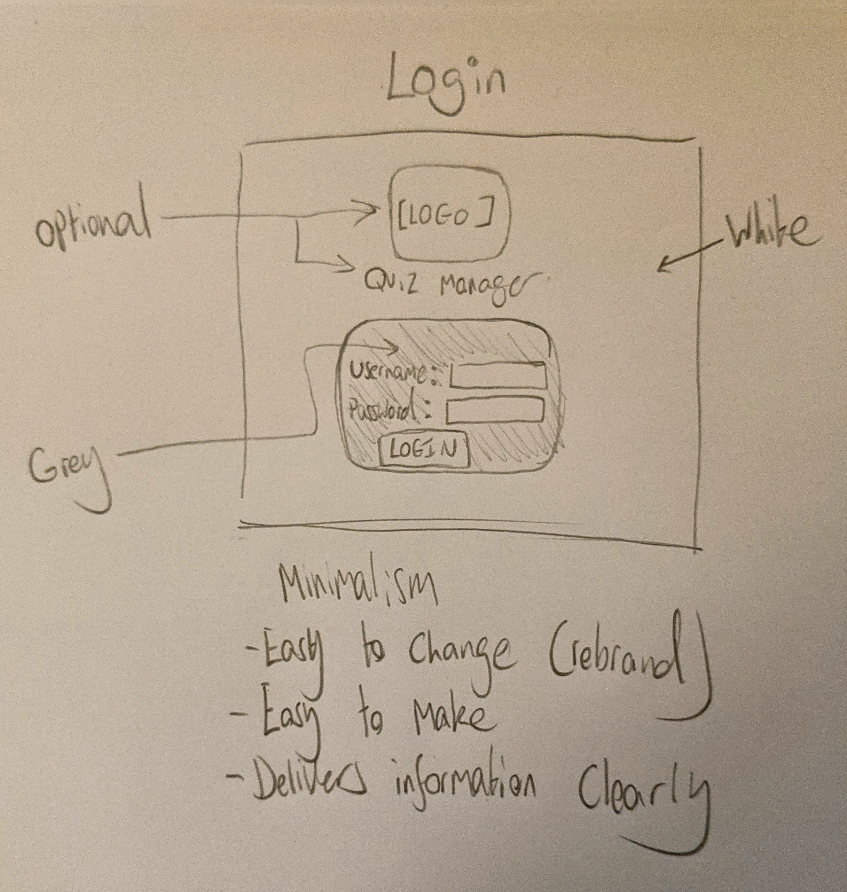

As you can see, I am intentionally trying to maintain a minimalist aesthetic for my quiz manager, with a colour scheme of primarily white (in the background) and grey (in the foreground). I value the functionality of the product over its appearance and will therefore be focusing more on the former than the latter. In addition, as noted, minimalism will make it easier to rebrand in the future, as there is less to change. I'm not married to the idea of putting the logo and title on the login page, but it makes sense as it will likely be the first thing a new or returning user sees when they use the website.

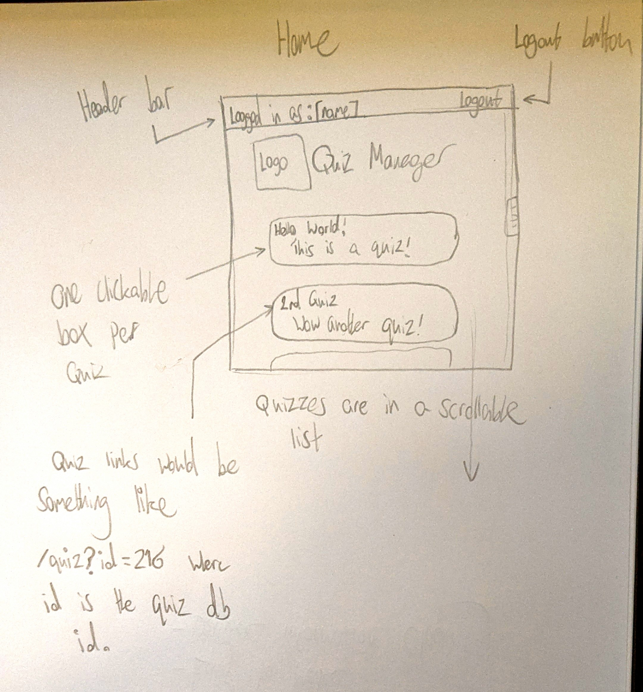

Once again, minimalism is key here. The main focus here is the list of clickable quiz buttons. The list will be as long as however many quizzes are in the database. I am imagining the homepage making a call to the backend, something like `localhost:8081/quizzes`, which will read from the database, then parse that data into usable JSON before returning it. React has the ability to iterate over an array and render an item for every element in the list. I learned and used it during my apprenticeship at American Express, so it should be a cinch to replicate it here. The backend will need to return:

- Name of the quiz
- Description (optional)
- ID of the quiz (to be used in the link).

As mentioned in the sketch, I'd like for the links to the quizzes to contain an "id" query string. This will easily allow the front end to ask the back end for the right questions associated with a quiz.

Finally, the quiz page itself:

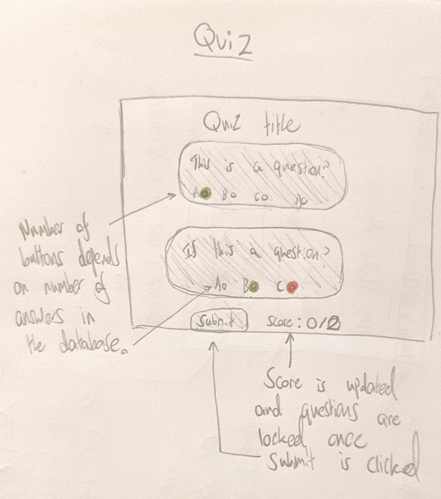

Similarly to the home page's quiz list, each question of the quiz will be rendered in its own box and will be numbered based on the order they are rendered. Answers will be in the form of radio buttons (meaning only one answer is selectable), and the user is able to submit their answers at the bottom of the page, where their score will then be revealed. If they chose correctly, then the button will be highlighted green. Otherwise their incorrect answer will be highlighted in red, with the correct answer shown in green.

The edit button, visible to "Edit" users, will bring the user to a similar page but with editable text **boxes** instead of text. The text boxes will be prefilled with quiz information and the user can change text or empty the boxes to delete the question or answer(s). The submit button is replaced with a "save" button. When the button is clicked, the data in the text boxes will be read and committed to the database.

### Database Plans

The fact that all quizzes will be viewable by any logged in user, and that a privileged user can edit any quiz, removes a lot of complexity from my database design. Overall my database will be heirarchal in design, with answers that belong to questions, and questions that belong to quizzes. I've written my plan out in text rather than drawing it in pencil for readabilities sake.

```
Quizzes
id: int
name: string
description: string

Questions
id: int
text: string
quiz_id: int, foreign key

Answers
id: int
text: string
question_id: int, foreign key
is_correct: bool
```

## Development

With a plan now firm in my mind, I'm ready to begin development. My first task will be setting up a React frontend and a Flask + SQLite backend.

### Installing React

I already had npm (Node Package Manager) set up on my computer from previous projects, so installing React was one simple line in my command line.

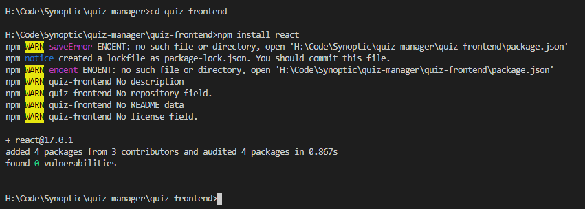

### Setting up React

Installing it was easy, but actually getting it to start has sent me spiralling into an existential crisis. There's a lot of fiddliness with getting a React project to work, let alone if you want to do something such as route multiple pages. Plain HTML and JavaScript requires you need only point to the location of the HTML page you'd like to load, but React requires a Router object and fiddling with props. Thus I am forced to confront if React would really be the best decision for this project.

### Pros and Cons

React:
- Points for style.
- Reusable components (a definite plus. It's tough to spawn components dynamically with vanilla JS.)

HTML + JS:
- Faster. Less overhead.
- Almost no setup time.
- Easier to route.

For this project, I will need to make API calls to a backend, then render visual HTML elements based on the JSON I receive from it. However, the HTML elements will need to be linked to the data they represent so that it can be compared later (the page needs to know the correct answers to the questions).

Since front ends are merely a means of interacting with the backend, I can be flexible with my implementation. I will work more on my backend before returning to this problem.

### Installing Flask

Installing Flask is easy, as is most things handled with Pip, Python's package manager. I already have Flask installed on my computer from previous projects, but ran the install command anyway for demonstrative purposes.

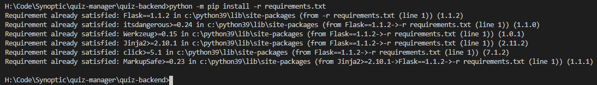

I also included a `requirements.txt` file in the root of my `quiz-backend` directory. This is a good practice which allows any new contributor or user of the project to know what versions of what dependencies need to be installed. My `requirements.txt` file is simple, as we only require one dependency for now.

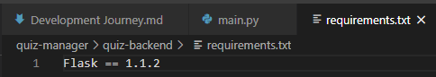

### Running Flask

Unlike React, running Flask is as easy as installing it. I wrote some very basic code and had it running in minutes. It returns "Hello, world!" when accessed at 127.0.0.1:5000.

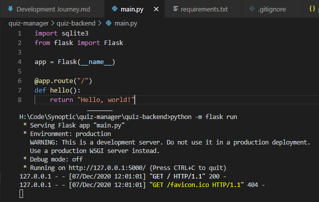

### Setting up the database

For starters, I like to keep the database in its own module for tidiness, and keep the connection and cursor as class (static) variables so that no matter what instance of the database object I have, I still have consistent access to the database.

```py
import sqlite3

def dict_factory(self, cursor, row):
    d = {}
    for idx, col in enumerate(cursor.description):
        d[col[0]] = row[idx]
    return d

class Database():

    connection = None
    cursor = None
    default_db_name = "quiz_manager.sqlite3"

    def __init__(self, db_name = None):
        if Database.connection is None:
            # Create new connection.
            Database.connection = sqlite3.connect(Database.default_db_name if db_name is None else db_name)
            Database.connection.row_factory = dict_factory # I don't like tuples so this makes it give me dictionaries instead. Much nicer.
            self.connection = Database.connection
        if Database.cursor is None:
            # Create new cursor if none found.
            Database.cursor = Database.connection.cursor()
            self.cursor = Database.cursor
```

I started with the usual boilerplate I use in every SQLite project.

- An `__init__` function that spawns new connections and cursors if none are present.
- A function that gives me dictionaries instead of tuples, which are the SQLite default. I find tuples to be troublesome and inflexible.

### Setting up Migration

The sooner I get database migration securely setup, the less chance of error I will have further down the line. Migration is essentially the practice of creating your database from start to finish in a way that is repeatable, similar to how Docker files work. I will implement a system that reads SQL files, hashes them, and runs them, storing the hash in a database for comparison the next time migration is done.

Here is the current skeleton I've built so far:

```py
self.cursor.execute("SELECT name FROM sqlite_master WHERE type='table' AND name='migrations'") # Check if migrations table already exists.
if self.cursor.fetchone() is None: # If it doesn't...
    with open("res/CREATE_MIGRATION_TABLE.sql") as create_migration_table: # Create it.
        self.cursor.executescript(create_migration_table.read())
        self.connection.commit()

for migration_file in sorted(glob.glob("res/M_*.sql")): # Find all migration files.
    with open(migration_file) as migration_script:
        migration_hash_current = sha256(migration_script.read().encode()).hexdigest()
        migration_hash_saved = self.cursor.execute("SELECT hash FROM migrations WHERE filename=:filename", {"filename": migration_file}).fetchone()

        print(f"Current hash: {migration_hash_current}")
        print(f"Saved hash: {migration_hash_saved}")

        if migration_hash_saved is None:
            print("Hash not found in migration table. Executing and saving to DB.")

        if migration_hash_current != migration_hash_saved:
            print("Hashes do not match.")
```

The migration table creation functionality works as intended, now I need to add the migration scripts necessary to create my database and all necessary tables (users, quizzes, questions, and answers).

### Logging

Flask doesn't enjoy `print`ing stuff, and I like to follow best practices, so rather than use print statements, I will be using a logger instead. Loggers allow a much greater degree of control over my informational output, including timestamps and recording log lines to file for later analysis.

```py
LOGGER.info("Beginning migration...")

[...]

LOGGER.info(f"Read file: {migration_script}")
LOGGER.info(f"Current hash: {migration_hash_current}")
LOGGER.info(f"Hash in database: {migration_hash_saved}")

if migration_hash_saved is None:
    LOGGER.info("Hash not found in database. Executing script and saving it to database.")

if migration_hash_current != migration_hash_saved:
    LOGGER.error(f"Hash of file {migration_script} does not match hash found in database.")

[...]

LOGGER.info(f"Migration complete! Ran {number_of_files} files.")
```

My logger configuration is setup in `main.py`, since that's the main entry point into the program.

```py
logger = logging.getLogger('quiz_manager')
formatter = logging.Formatter(fmt='%(asctime)s.%(msecs)03d :: %(levelname)s :: %(message)s', datefmt='%Y-%m-%d :: %H:%M:%S')
ch = logging.StreamHandler()
ch.setFormatter(formatter)
fh = logging.FileHandler('quiz_manager_logs.txt')
fh.setFormatter(formatter)
logger.addHandler(fh)
logger.addHandler(ch)
logger.setLevel(logging.INFO)
```

The following configuration and log lines in migration currently produce the following output when ran:

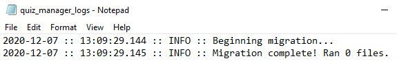

This is a much better alternative than printing with wild abandon. It's informative, accurate, and persistent.

### Okay, back to migration.

It waw fairly simple to get the remainder of my migration code up and running. You can see the version I am happy with [here](https://github.com/mtmars-aexp/quiz-manager/commit/6c8c7799c2924a3d484033bafab183712e21bb92#diff-2d995d9d23c0dabc2a69694c4f9d08b8a3c8d1476e756f7aa7b6a561e73e40cb) on my GitHub page.

Now the code executes the SQL file if its hash is not found in the Migrations table, and inserts it there afterwards, otherwise it will compare the hashes to check for a mismatch and raise an exception if one is noticed. File hashes are the de facto way of checking file validity because they are a fixed-length series of bytes calculated using very fancy mathematics based on the binary data of any file, meaning if even a single bit is changed the hash will calculate different and you will know something has changed.

### Adding Test Data.

Alright, my first migration file, `M_0001_CREATE_SCHEMA.sql`, creates the backend's three main data tables:

```
CREATE TABLE Quizzes (
	quiz_id integer PRIMARY KEY,
	name text NOT NULL,
	description text
);

CREATE TABLE Questions (
	question_id integer PRIMARY KEY,
	quiz_id integer,
	text text NOT NULL
);

CREATE TABLE Answers (
	answer_id integer PRIMARY KEY,
	question_id integer,
	text text NOT NULL
);
```

As you can see, it's very similar to the plan mentioned earlier in the design section. Let's hope the rest of the project is as one-to-one. Now, for the test data, which I will tidily add in `M_0003_ADD_TEST_DATA.sql`. Before that, however, I need to add a `M_0002_ADD_AUTO_INCREMENT.sql` file, because I forgot to add auto incrementation to my original column definitions. The easiest and simplest way to do this is to drop all three tables and redefine them.

```
DROP TABLE Quizzes;
DROP TABLE Questions;
DROP TABLE Answers;

CREATE TABLE Quizzes (
	quiz_id integer PRIMARY KEY AUTOINCREMENT,
	name text NOT NULL,
	description text
);

CREATE TABLE Questions (
	question_id integer PRIMARY KEY AUTOINCREMENT,
	quiz_id integer,
	text text NOT NULL
);

CREATE TABLE Answers (
	answer_id integer PRIMARY KEY AUTOINCREMENT,
	question_id integer,
	text text NOT NULL
);
```

Now we can add our test data.

```
INSERT INTO Quizzes(quiz_id, name, description) VALUES(1, "Alpha quiz!","Beep boop!"), (2, "Beta quiz!","Boop beep?? :O");
INSERT INTO Questions(question_id, quiz_id, text) VALUES(1,1,"Who's a good boy??"), (2,2,"Are you a robot?");
INSERT INTO Answers(answer_id, question_id, text) VALUES(1,1,"Wruff!"),(2,1,"Me me me!!"),(3,2,"Yes!"),(4,2,"Absolutely!");
```

Truly a historic moment, I wrote that first time without any syntax errors.

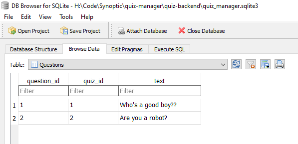

Taking a look at my hand SQLite database browser, I can see the test data has been successfully added. Now let's see if I can access that data through a Flask endpoint.

### Accessing Data Via a Flask Endpoint

At the moment I'm still too paralyzed with indecision to make a choice regarding React vs Pure HTML, so I will be making these requests through Postman, a tool for testing and making API requests.

While writing some simple code to query my database after an endpoint is hit, I ran into an unexpected error.

```py
[main.py]
@app.route("/")
def home():
    return db.get_all_quizzes()

[database.py]
def get_all_quizzes(self):
    self.cursor.execute("SELECT * FROM Quizzes;")
    return self.cursor.fetchall()
```

```py
self.cursor.execute("SELECT * FROM Quizzes;")
sqlite3.ProgrammingError: SQLite objects created in a thread can only be used in that same thread. The object was created in thread id 1452 and this is thread id 10264.
```

I've never seen this error before, as I've used Flask and SQL lite before but rarely combined the two in a sophisticated manner. Databases are governed by the "ACID" principles, which stand for "Atomicity, Consistency, Isolation, and Durability." In brief, they are designed to reduce data conflicts by guaranteeing certain things such as "That data either _was_ or _was not_ inserted. There is no inbetween." Asyncronous threads throw a big wrench into this plan, which is what is happening here. I'm trying to access an SQLite connection created by another thread, which could lead to data inconsistencies down the line. I usually like to keep a persistent connection to the SQLite database, but if SQLite deems it unwise in conjunction with Flask's asyncrynocity, then I will refactor my code accordingly.

### A Brief Refactoring

This is a minor setback and an easy fix. I will simply refactor my database module to no longer be an object. I will call the methods directly and I will open the connections as and when I need them. I'm concerned about the overhead of having to constantly open and close connections but I'm similarly happy about the _lack_ of overhead from no longer needing to instantiate an object.

```py
def migrate():

    LOGGER.info("Beginning migration...")

    connection = sqlite3.connect(db_name)
    connection.row_factory = dict_factory
    cursor = connection.cursor()
```

Aand done. Database has been refactored. You can see the changes [here](https://github.com/mtmars-aexp/quiz-manager/commit/46d60f2566c23529d108815bd307a00f611755df#diff-2d995d9d23c0dabc2a69694c4f9d08b8a3c8d1476e756f7aa7b6a561e73e40cb). All I really had to do was remove the `__init__`, trim the `self.` off the start of function calls, and make sure they were similarly removed from function parameters. Something to note, however, is that each connection must have its row factory reassigned if I want to recieve dictionaries. This could be troublesome if I end up writing a lot more database access functions in the future. I'm considering adding a `get_cursor()` function that creates a new connection and returns the cursor for it, row factory attached.

Anyway, back to the task at hand...

### Back to Flask Endpoints

I am now able to return data from the database (almost!) Flask doesn't support returning a dictionary object right to the view, but I was able to log the returned object instead. Now all I need to do is convert the dictionary to JSON and I should be able to return it as a string.

```py
@app.route("/")
def home():
    quizzes = db.get_all_quizzes()
    LOGGER.info(quizzes)
    return "Here you go!"
```

```
2020-12-07 :: 14:22:21.684 :: INFO :: [{'quiz_id': 1, 'name': 'Alpha quiz!', 'description': 'Beep boop!'}, {'quiz_id': 2, 'name': 'Beta quiz!', 'description': 'Boop beep?? :O'}]
```

And wouldn't you know it, Python, being the most useful language ever, has a json library that can take in a list of dictionaries and splurg out some nice tasty JSON. All it took was changing the return statement to `return json.dumps(quizzes)` and it works! 

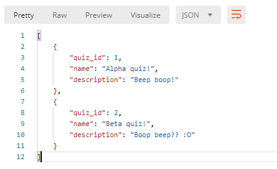

### Time to Man Up

Alright, I've had some lunch from a delicious vegan Athenian place, I've had a drinky, and I've made a decision: I will man up and use React. I'm a big strong boy and I looked up the react Router and it honestly doesn't seem that terrifying. I intend to use the `create-react-app` tool rather than installing React and attempting to fumble blindly.

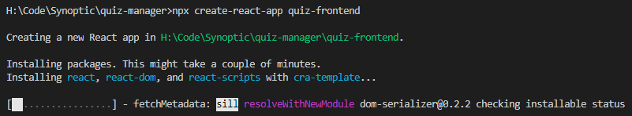

I'm glad the npm and `create-react-app` installer looks so pretty because I'd be bored to tears otherwise given how long it takes to install. Anyways, easy install! This is much more befitting a small baby child developer such as I, hands uncalloused, sheltered from all the wearies of the world. And now, the moment of truth:


It works! Huzzah. Pop the champagne. With this solid foundation I can now begin to build my grand, and wonderful quiz manager.

...Alright, celebration over. First order of business: Let's get some data from the backend to my frontend. We already have an endpoint giving us JSON, so let's get that displayed as a string on the page for now.

### Bridging the Gap

Using JavaScript's "fetch" is what is known amongst my very professional collegues as "a goddamn hassle." However, I do not intend to let it get the best of me. I have spent many moons mastering fetch and, although I've fallen out of practice as of late, I feel confident that I will achieve a quick and decisive victory.

### CORS, My Long Standing Nemesis

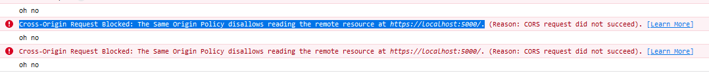

CORS you absolute fiend. If you, dear reader, have also happened to have read my apprenticeship portfolio, then you know CORS and I are long-standing enemies. I imagine it is also the enemy of every other inexperienced dev out there. Basically, it's being super secure and saying "Hey! You _have_ to explicitly allow access to this resource from _this_ address otherwise I'm not having any part in it!" Which in any other situation I'd be happy with, speaking as a cybersecurity analyst, but right now it's like "Could you just chill? Please? Thank you."

Anyways, googled it; internet is saying to download a plugin for Flask called- surprise surprise- `Flask-CORS`. Hopefully it'll also get rid of the demonic possession my terminal is undergoing whenever my front end sends a request.

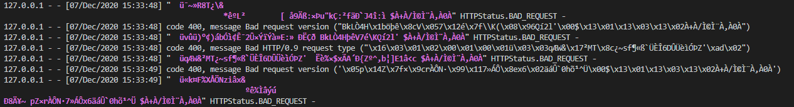

Installation: Check
```
H:\Code\Synoptic\quiz-manager\quiz-backend>python -m pip install -U flask-cors
Collecting flask-cors
  Downloading Flask_Cors-3.0.9-py2.py3-none-any.whl (14 kB)
Requirement already satisfied: Flask>=0.9 in c:\python39\lib\site-packages (from flask-cors) (1.1.2)
Requirement already satisfied: click>=5.1 in c:\python39\lib\site-packages (from Flask>=0.9->flask-cors) (7.1.2)
Requirement already satisfied: itsdangerous>=0.24 in c:\python39\lib\site-packages (from Flask>=0.9->flask-cors) (1.1.0)
Requirement already satisfied: Jinja2>=2.10.1 in c:\python39\lib\site-packages (from Flask>=0.9->flask-cors) (2.11.2)
Requirement already satisfied: Werkzeug>=0.15 in c:\python39\lib\site-packages (from Flask>=0.9->flask-cors) (1.0.1)
Requirement already satisfied: MarkupSafe>=0.23 in c:\python39\lib\site-packages (from Jinja2>=2.10.1->Flask>=0.9->flask-cors) (1.1.1)
Collecting Six
  Downloading six-1.15.0-py2.py3-none-any.whl (10 kB)
Installing collected packages: Six, flask-cors
Successfully installed Six-1.15.0 flask-cors-3.0.9
```

Code change: Check
```py
from flask import Flask
from flask_cors import CORS
import logging
import json

app = Flask(__name__)
CORS(app)
```
(Yes, that's really all it takes!)

Requests: Making progress! We are now getting data. Still having errors rendering it, but that's just because I can't render objects directly. I'll need to plug it into a component first.

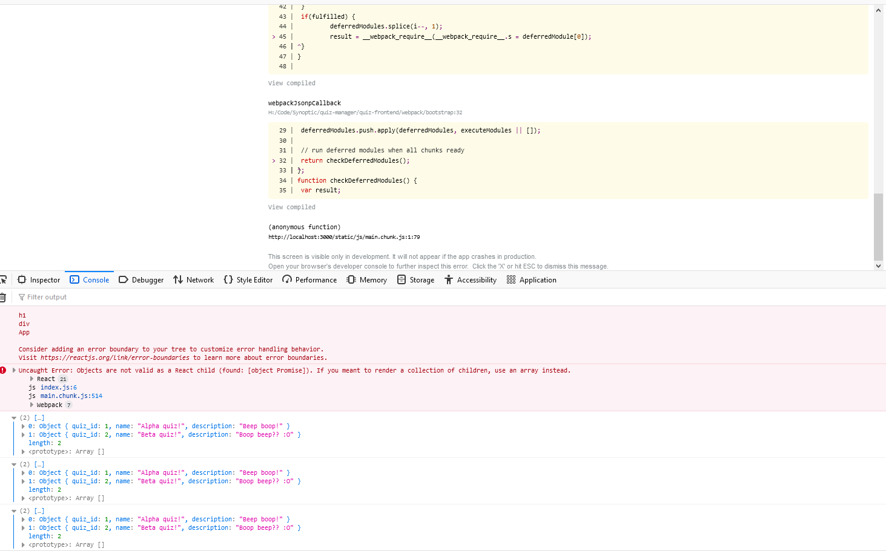

So! Let's make my first component.

### A Brief Side Note

This isn't the first time I fell into this trap, but did you know GitHub desktop, my client of choice, has, like, two places for you to sign into?

In preparation for this project I'd signed into my account in the "Accounts" tab, which gives me full access to create repos in my own name...

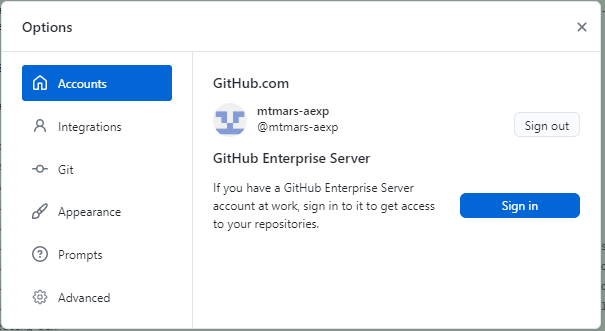

However, the name under which you commit things is determined by the information in the _Git_ tab! Which was, up until just now, had credentials for `avn-0216-m`.

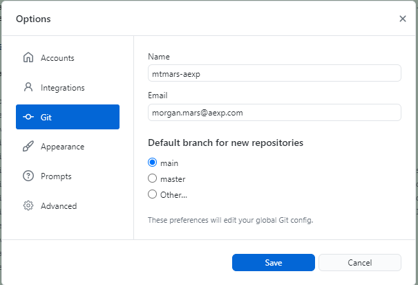

Anyways, all the commits up until now have been made by my personal side account, `avn-0216-m`, hopefully this issue should now be resolved unless there's some third place that GitHub stores your login creds. (Rolling my eyes, sarcastically).

### Back on Track: Rendering Object Data as Components.

Let's make a component!

```js
function QuizButton(){
    return(
        <div>
            <h1>This is a quiz button!</h1>
        </div>
    );
}

export default QuizButton;
```

Wow! I made a component. There was no pause between my last two sentences so it's difficult to convey the passage of time but that took a few minutes!

Anyways, it works! Here's how it looks:

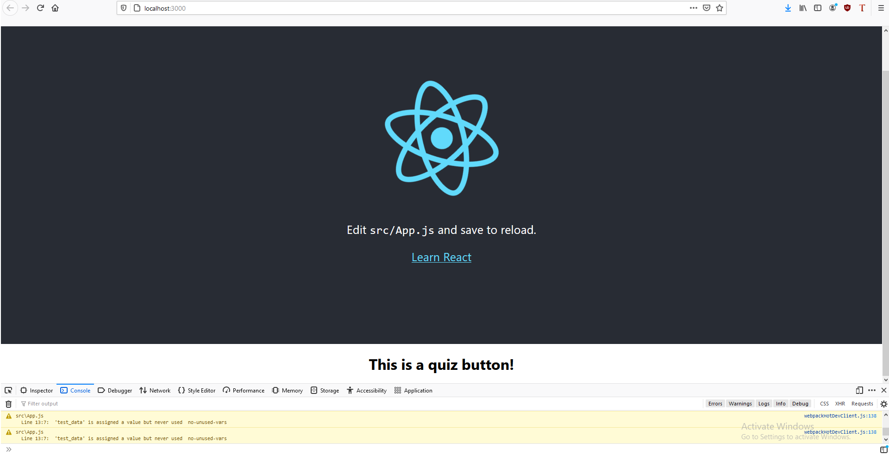

Let's see if I can give it some data. Right now I'm just rendering a single `<QuizButton/>` as a test. But let's stick it in a for loop and see if I can pass it some data as props.

### Remember That Time I Thought I Was Good Enough With Fetch For This To Be A Swift And Decisive Victory?

Turns out that is not the case! I'm pretty sure the reason React is being fussy right now is because I'm trying to make it iterate over an unresolved promise, which is what is known in the business as "silly of me." I'm gonna do some digging and see if I can remember how to resolve promises. And CORS has once again reared its ugly for head for seemingly no reason. Gosh darn it.

## Day 2: Electric Boogaloo

Hello again. I had a nice, looong shower yesterday, which gave me plenty of time to think things through, do some research online, and debug not only the mental mind map of my code, but also the my soft and gently composting brain (yesterday was rough on my wee baby mind). But I'll be damned if I didn't find a way to fix whatever the heck was going on yesterday (Spoiler alert: I'm not damned). I'm full of jam toast, coffee, and hope. Let's get this done.

## Development

Okay, so, real talk? This was all on me. I was absolutely not doing things "the React way" or whatever, or even just like, "the way that makes any sort of sense." For starters I was trying to do the data fetching in the App component at first, which for those familiar with React is the root of the app and shouldn't really have logic done in it as its more of a host for other components (and also isn't a component itself as it doesn't extend React.Component). Then, when I realized my first error and moved it into its own container component, I completely forgot about the `componentDidMount()` function. Like?? Duh! I should probably grab the data once I _know_ it's succesfully loaded itself. Anyways, I got all that logic figured out, and now I just need to successfully extract the data from the promise.

### Figuring Out How To Keep Promises, Or: How I Became A Licensed Relationship Counselor.

So! Usually, when I'm having trouble with code functions, I like to look up the javadoc (or similar) for it. The API reference, y'know? "Here's what you put in, here's what you get out." However, I didn't do that this time, and I was very silly for it. For some reason in my head I had the idea that calling something like `.then(data => data.json())` would resolve the promise into proper data and give it to me when I returned the result of the `.then()`. BUT, APPARENTLY, TODAY I LEARNED: The output of a `.then()` is _always_ **another** promise!! So no matter how many times you `.then().then().then()` something, you aren't ever gonna get a resolved promise out of it! I'm not mad, I promise I'm not mad. I'm actually quite fond of the solution I came up with.

```js
componentDidMount() {
    console.log("Home page component mounted. Getting available quizzes.")
    fetch("http://127.0.0.1:5000")
    .then(result => result.json())
    .then(result_json => this.setState({quizzes: result_json}))
    .catch(err => console.log(err))
}
```

I call it the "jump ship" approach. I got the data, so let's toss it into the state and bother ourselves no more with this `.then().then()` madness. I tried combining the two `.then()`s into one by doing `.then(result => this.setState({quizzes: result.json()}))` but that just made it say it was "undefined" and I don't know why that is.

### Side Note: Like An Ethical Genetic Hazard, Do Not Mutate The State Directly

If you call `this.state.[your thing] = [your value]` like I did, then that's silly. Updating the state should always make the component rerender, but it won't do that if you mutate it directly, as opposed to calling `setState()`. Small note, but worth mentioning. Honestly I think this is going to be a great resource for future-me when I inevitably have to relearn react once again.

### Oh By The Way How Is CORS Doing Today?

CORS is very agreeable, thank you for asking! When I mentioned it "reared its ugly head" yesterday, what I really meant by that was, "I am a scared caveman and something happened which I am unfamiliar with therefore I am terrified of it."

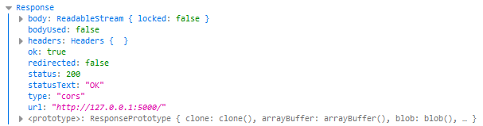

This was very unfamiliar to me! And I was all like "ughhh don't wanna have to deal with more CORS stuff! Why can't you just give me the data??" But! As it turns out, calling `.then(result => result.json())` will, in fact, just give you the data.

### Let's Procedurally Render Some Components

After much trial and error, I got it! Using JavaScript in the `render()` function is a whole heapin' spaghetti pile of curly braces. It's awful confusing. Anyway, here's a quick run down of what I did:

- Made my quiz button into a component, because it turns out I'd forgotten to do that.
- Tried using `Array.forEach()` to spawn a quiz button component for every element in the array of data from the backend.
- Got really confused as to why it wasn't rendering anything. Looked it up on Stack Overflow- turns out `.forEach()` inherently does not return anything and I should use `.map()` instead. Whoops!
- Now everything works! My code is nice, I understand it, and components are being rendered!

```js
render(){
    console.log("There are " + this.state.quiz_data.length + " quizzes available.")
    return (
        <div>
            <h1>This is the home page!</h1>
            <h1>You have {this.state.quiz_data.length} quizzes available.</h1>
            {this.state.quiz_data.map((element, index) => <QuizButton name={element.name}/>)}
        </div>
    )
}
```

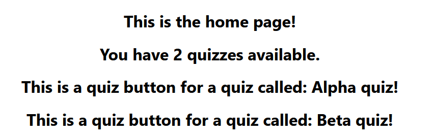

I'm aware it looks like I've just put some text on the page, but bare with me, it'll look better (and much more belivable) very soon.

### Some Front End Design

Curved boxes are very easy to do with basic CSS and make your website look fab. I did it [on my website](https://mtmars-aexp.github.io/) to great effect, and I'm gonna do it here, too!

Right, after suffering with CSS for a hot minute, I think I've got it.

```css
body {
  font-family: -apple-system, BlinkMacSystemFont, 'Segoe UI', 'Roboto', 'Oxygen',
    'Ubuntu', 'Cantarell', 'Fira Sans', 'Droid Sans', 'Helvetica Neue',
    sans-serif;
  -webkit-font-smoothing: antialiased;
  -moz-osx-font-smoothing: grayscale;
  text-align: center;
}

.quiz-box{
  margin: 10px;
  border: 3px #000000 solid;
  border-radius: 30px;
  width: 50%;
  display: inline-block;
}
```

The secret was in `display: inline-block`, the deeper mysteries of which I am still not privvy to.

Actually! Scratch that. Hello! This is me speaking about half an hour later! I've just written some even better CSS!

```css
body {
  font-family: -apple-system, BlinkMacSystemFont, 'Segoe UI', 'Roboto', 'Oxygen',
    'Ubuntu', 'Cantarell', 'Fira Sans', 'Droid Sans', 'Helvetica Neue',
    sans-serif;
  -webkit-font-smoothing: antialiased;
  -moz-osx-font-smoothing: grayscale;
  text-align: center;
  width: 50%;
  margin: auto;
}

.quiz-box{
  position: relative;
  border: 3px #000000 solid;
  border-radius: 10px;
  background-color: lightgray;
  height: 100px;
  margin-bottom: 20px;
}

.quiz-box .quiz-title{
  position: absolute;
  top: 15px;
  left: 15px;
}

.quiz-box .quiz-description{
  position: absolute;
  right: 15px;
  bottom: 15px;
}
```

It looks so much better! And I have a firmer grasp on positioning and how child elements utilize the positioning type of their parents. I still don't quite understand the different between block elements and spans... But? This looks nice. Take a look.

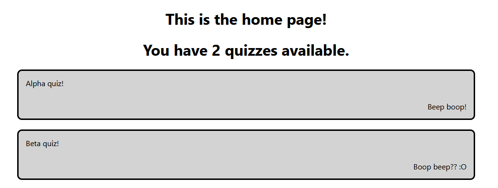

If I have the time, I'd like to use SASS in the future to make the `15px` used in my absolute positioning a variable that can be easily modified, without needing to change it in 4 different places, for the sake of an easier rebrand/future revision.

Alright, that's enough aesthetics for now. Next I'd like to implement a router.

### Implementing a Router

Wow! That was so easy, and only took me 5 minutes tops. No idea why I was so scared of routers yesterday.


Here's the code required to make it all happen:

```js
function App() {

  return (
    <Router>
      <div className="App">
        <Route path="/" exact component={Home}/>
        <Route path="/secret" component={Secret}/>
      </div>
    </Router>
  );
}
```

It really was as easy as "Render _this_ component if you're at _this_ path."