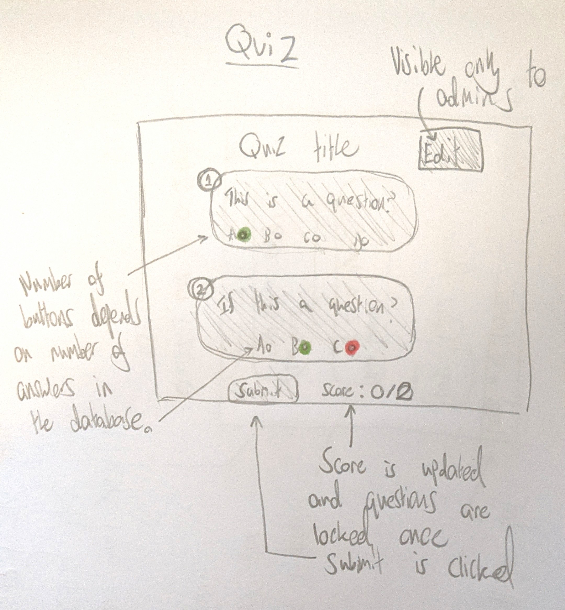

# Quiz Manager

Hello, dear reader. If you're reading this, then you are likely interested in how this quiz manager came to be developed. I am currently writing this with no work done, as this is the first thing I'm doing, so I don't have a very interesting foreword. Read on, dear reader, and join me on an adventure of quizzes and the management thereof.

## Overview.

I've got 5 days, and a total of 40 hours, to create a quiz manager for the hypothetical "WebbiSkools Ltd". Here are some important points from the document I was given:

- Users will require three different permission levels. Most (View and edit questions and answers), middling (can view questions and answers but not edit), and least (can only view questions). This is different to what I initially envisoned about a quiz manager. I assumed any user would be able to create and edit their own quizzes, and have those creations safe from edits by other users. However, in the context of an educational environment, where a teacher would require authority and control, this model makes sense.

- Every question is multiple choice. The amount of answers is not specified but for now we can assume 4.

- "The website should be designed to be straightforward to re-brand, by encapsulating the definition of colour schemes, styles, company logos and so on." This piece of criteria, while unexpected, should be easy to fulfil through the use of CSS on the front end.

- "For this version of the website the set of known users with their passwords and permissions will be pre-configured; the website does not need to provide capabilities for user registration, password reset, or change of permission." While I was looking forward to implementing these systems, I suppose this does mean I have to do less work, haha. This means I should only have to implement the login system, and storing the session in a cookie for the browser.

- "Users can logout" A very important requirement. I'd hate to be trapped in a quiz manager forever.

- "Permission levels should be either Edit, View, or Restricted" Good, I've got names for the permission types.

- A quiz has a title and a numbered sequence of questions. Each question is a text string. Each question has **between 3 and 5 answers** (this answers my above assumption about there only being 4 answers).

## Day 1

### Design and Planning

Alright, having reviewed the document, I'm ready to begin. I'm going to create some additional documentation to help puzzle out my thoughts. The last thing I want to do is get half way into making a database or UI only to realize it doesn't actually work. I plan on developing this application using React (a JavaScript framework) for my front end user interface, and Flask (a python framework) for my backend database work. I intend for my database to be ran with SQLite.

### Time planner


I made a time planner to keep myself focused and on target. 5 days is a lean amount of time to get a full stack project up and running in. I believe development will be the meatiest and most difficult task here, hence why I'm allotting 3 days for it. Design should be finished by the end of the day, hopefully with time to get started on development. Testing and documentation, especially documentation, shouldn't be too difficult (knock on wood), but I've allowed some overrun into the next day in case something goes awry.

### UI Plans

I've decided to sketch out my ideas for the UI on paper, because I don't know of any reliable UI tools and didn't want to waste valuable time finding and learning one.

Firstly: The login page.


As you can see, I am intentionally trying to maintain a minimalist aesthetic for my quiz manager, with a colour scheme of primarily white (in the background) and grey (in the foreground). I value the functionality of the product over its appearance and will therefore be focusing more on the former than the latter. In addition, as noted, minimalism will make it easier to rebrand in the future, as there is less to change. I'm not married to the idea of putting the logo and title on the login page, but it makes sense as it will likely be the first thing a new or returning user sees when they use the website.


Once again, minimalism is key here. The main focus here is the list of clickable quiz buttons. The list will be as long as however many quizzes are in the database. I am imagining the homepage making a call to the backend, something like `localhost:8081/quizzes`, which will read from the database, then parse that data into usable JSON before returning it. React has the ability to iterate over an array and render an item for every element in the list. I learned and used it during my apprenticeship at American Express, so it should be a cinch to replicate it here. The backend will need to return:

- Name of the quiz
- Description (optional)
- ID of the quiz (to be used in the link).

As mentioned in the sketch, I'd like for the links to the quizzes to contain an "id" query string. This will easily allow the front end to ask the back end for the right questions associated with a quiz.

Finally, the quiz page itself:



Similarly to the home page's quiz list, each question of the quiz will be rendered in its own box and will be numbered based on the order they are rendered. Answers will be in the form of radio buttons (meaning only one answer is selectable), and the user is able to submit their answers at the bottom of the page, where their score will then be revealed. If they chose correctly, then the button will be highlighted green. Otherwise their incorrect answer will be highlighted in red, with the correct answer shown in green.

The edit button, visible to "Edit" users, will bring the user to a similar page but with editable text **boxes** instead of text. The text boxes will be prefilled with quiz information and the user can change text or empty the boxes to delete the question or answer(s). The submit button is replaced with a "save" button. When the button is clicked, the data in the text boxes will be read and committed to the database.

### Database Plans

The fact that all quizzes will be viewable by any logged in user, and that a privileged user can edit any quiz, removes a lot of complexity from my database design. Overall my database will be heirarchal in design, with answers that belong to questions, and questions that belong to quizzes. I've written my plan out in text rather than drawing it in pencil for readabilities sake.

```
Quizzes
id: int
name: string
description: string

Questions
id: int
text: string
quiz_id: int, foreign key

Answers
id: int
text: string
question_id: int, foreign key
is_correct: bool
```