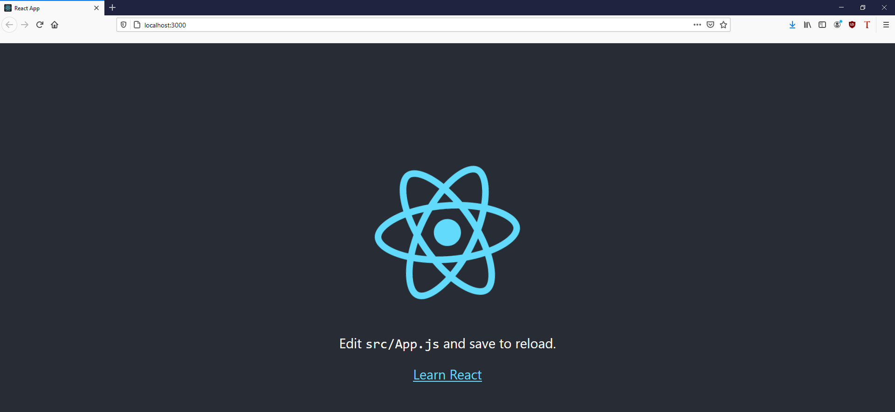
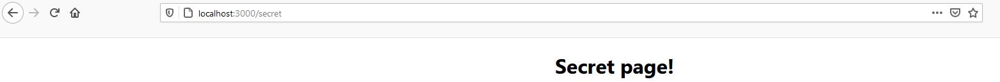

# Quiz Manager

Hello, dear reader. If you're reading this, then you are likely interested in how this quiz manager came to be developed. I am currently writing this with no work done, as this is the first thing I'm doing, so I don't have a very interesting foreword. Read on, dear reader, and join me on an adventure of quizzes and the management thereof.

## Overview.

I've got 5 days, and a total of 40 hours, to create a quiz manager for the hypothetical "WebbiSkools Ltd". Here are some important points from the document I was given:

- Users will require three different permission levels. Most (View and edit questions and answers), middling (can view questions and answers but not edit), and least (can only view questions). This is different to what I initially envisoned about a quiz manager. I assumed any user would be able to create and edit their own quizzes, and have those creations safe from edits by other users. However, in the context of an educational environment, where a teacher would require authority and control, this model makes sense.

- Every question is multiple choice. The amount of answers is not specified but for now we can assume 4.

- "The website should be designed to be straightforward to re-brand, by encapsulating the definition of colour schemes, styles, company logos and so on." This piece of criteria, while unexpected, should be easy to fulfil through the use of CSS on the front end.

- "For this version of the website the set of known users with their passwords and permissions will be pre-configured; the website does not need to provide capabilities for user registration, password reset, or change of permission." While I was looking forward to implementing these systems, I suppose this does mean I have to do less work, haha. This means I should only have to implement the login system, and storing the session in a cookie for the browser.

- "Users can logout" A very important requirement. I'd hate to be trapped in a quiz manager forever.

- "Permission levels should be either Edit, View, or Restricted" Good, I've got names for the permission types.

- A quiz has a title and a numbered sequence of questions. Each question is a text string. Each question has **between 3 and 5 answers** (this answers my above assumption about there only being 4 answers).

# Day 1

## Design and Planning

Alright, having reviewed the document, I'm ready to begin. I'm going to create some additional documentation to help puzzle out my thoughts. The last thing I want to do is get half way into making a database or UI only to realize it doesn't actually work. I plan on developing this application using React (a JavaScript framework) for my front end user interface, and Flask (a python framework) for my backend database work. I intend for my database to be ran with SQLite.

### Time planner


I made a time planner to keep myself focused and on target. 5 days is a lean amount of time to get a full stack project up and running in. I believe development will be the meatiest and most difficult task here, hence why I'm allotting 3 days for it. Design should be finished by the end of the day, hopefully with time to get started on development. Testing and documentation, especially documentation, shouldn't be too difficult (knock on wood), but I've allowed some overrun into the next day in case something goes awry.

### UI Plans

I've decided to sketch out my ideas for the UI on paper, because I don't know of any reliable UI tools and didn't want to waste valuable time finding and learning one.

Firstly: The login page.


As you can see, I am intentionally trying to maintain a minimalist aesthetic for my quiz manager, with a colour scheme of primarily white (in the background) and grey (in the foreground). I value the functionality of the product over its appearance and will therefore be focusing more on the former than the latter. In addition, as noted, minimalism will make it easier to rebrand in the future, as there is less to change. I'm not married to the idea of putting the logo and title on the login page, but it makes sense as it will likely be the first thing a new or returning user sees when they use the website.


Once again, minimalism is key here. The main focus here is the list of clickable quiz buttons. The list will be as long as however many quizzes are in the database. I am imagining the homepage making a call to the backend, something like `localhost:8081/quizzes`, which will read from the database, then parse that data into usable JSON before returning it. React has the ability to iterate over an array and render an item for every element in the list. I learned and used it during my apprenticeship at American Express, so it should be a cinch to replicate it here. The backend will need to return:

- Name of the quiz
- Description (optional)
- ID of the quiz (to be used in the link).

As mentioned in the sketch, I'd like for the links to the quizzes to contain an "id" query string. This will easily allow the front end to ask the back end for the right questions associated with a quiz.

Finally, the quiz page itself:


Similarly to the home page's quiz list, each question of the quiz will be rendered in its own box and will be numbered based on the order they are rendered. Answers will be in the form of radio buttons (meaning only one answer is selectable), and the user is able to submit their answers at the bottom of the page, where their score will then be revealed. If they chose correctly, then the button will be highlighted green. Otherwise their incorrect answer will be highlighted in red, with the correct answer shown in green.

The edit button, visible to "Edit" users, will bring the user to a similar page but with editable text **boxes** instead of text. The text boxes will be prefilled with quiz information and the user can change text or empty the boxes to delete the question or answer(s). The submit button is replaced with a "save" button. When the button is clicked, the data in the text boxes will be read and committed to the database.

### Database Plans

The fact that all quizzes will be viewable by any logged in user, and that a privileged user can edit any quiz, removes a lot of complexity from my database design. Overall my database will be heirarchal in design, with answers that belong to questions, and questions that belong to quizzes. I've written my plan out in text rather than drawing it in pencil for readabilities sake.

```
Quizzes
id: int
name: string
description: string

Questions
id: int
text: string
quiz_id: int, foreign key

Answers
id: int
text: string
question_id: int, foreign key
is_correct: bool
```

## Development

With a plan now firm in my mind, I'm ready to begin development. My first task will be setting up a React frontend and a Flask + SQLite backend.

### Installing React

I already had npm (Node Package Manager) set up on my computer from previous projects, so installing React was one simple line in my command line.


### Setting up React

Installing it was easy, but actually getting it to start has sent me spiralling into an existential crisis. There's a lot of fiddliness with getting a React project to work, let alone if you want to do something such as route multiple pages. Plain HTML and JavaScript requires you need only point to the location of the HTML page you'd like to load, but React requires a Router object and fiddling with props. Thus I am forced to confront if React would really be the best decision for this project.

### Pros and Cons

React:
- Points for style.
- Reusable components (a definite plus. It's tough to spawn components dynamically with vanilla JS.)

HTML + JS:
- Faster. Less overhead.
- Almost no setup time.
- Easier to route.

For this project, I will need to make API calls to a backend, then render visual HTML elements based on the JSON I receive from it. However, the HTML elements will need to be linked to the data they represent so that it can be compared later (the page needs to know the correct answers to the questions).

Since front ends are merely a means of interacting with the backend, I can be flexible with my implementation. I will work more on my backend before returning to this problem.

### Installing Flask

Installing Flask is easy, as is most things handled with Pip, Python's package manager. I already have Flask installed on my computer from previous projects, but ran the install command anyway for demonstrative purposes.


I also included a `requirements.txt` file in the root of my `quiz-backend` directory. This is a good practice which allows any new contributor or user of the project to know what versions of what dependencies need to be installed. My `requirements.txt` file is simple, as we only require one dependency for now.


### Running Flask

Unlike React, running Flask is as easy as installing it. I wrote some very basic code and had it running in minutes. It returns "Hello, world!" when accessed at 127.0.0.1:5000.


### Setting up the database

For starters, I like to keep the database in its own module for tidiness, and keep the connection and cursor as class (static) variables so that no matter what instance of the database object I have, I still have consistent access to the database.

```py
import sqlite3

def dict_factory(self, cursor, row):
    d = {}
    for idx, col in enumerate(cursor.description):
        d[col[0]] = row[idx]
    return d

class Database():

    connection = None
    cursor = None
    default_db_name = "quiz_manager.sqlite3"

    def __init__(self, db_name = None):
        if Database.connection is None:
            # Create new connection.
            Database.connection = sqlite3.connect(Database.default_db_name if db_name is None else db_name)
            Database.connection.row_factory = dict_factory # I don't like tuples so this makes it give me dictionaries instead. Much nicer.
            self.connection = Database.connection
        if Database.cursor is None:
            # Create new cursor if none found.
            Database.cursor = Database.connection.cursor()
            self.cursor = Database.cursor
```

I started with the usual boilerplate I use in every SQLite project.

- An `__init__` function that spawns new connections and cursors if none are present.
- A function that gives me dictionaries instead of tuples, which are the SQLite default. I find tuples to be troublesome and inflexible.

### Setting up Migration

The sooner I get database migration securely setup, the less chance of error I will have further down the line. Migration is essentially the practice of creating your database from start to finish in a way that is repeatable, similar to how Docker files work. I will implement a system that reads SQL files, hashes them, and runs them, storing the hash in a database for comparison the next time migration is done.

Here is the current skeleton I've built so far:

```py
self.cursor.execute("SELECT name FROM sqlite_master WHERE type='table' AND name='migrations'") # Check if migrations table already exists.
if self.cursor.fetchone() is None: # If it doesn't...
    with open("res/CREATE_MIGRATION_TABLE.sql") as create_migration_table: # Create it.
        self.cursor.executescript(create_migration_table.read())
        self.connection.commit()

for migration_file in sorted(glob.glob("res/M_*.sql")): # Find all migration files.
    with open(migration_file) as migration_script:
        migration_hash_current = sha256(migration_script.read().encode()).hexdigest()
        migration_hash_saved = self.cursor.execute("SELECT hash FROM migrations WHERE filename=:filename", {"filename": migration_file}).fetchone()

        print(f"Current hash: {migration_hash_current}")
        print(f"Saved hash: {migration_hash_saved}")

        if migration_hash_saved is None:
            print("Hash not found in migration table. Executing and saving to DB.")

        if migration_hash_current != migration_hash_saved:
            print("Hashes do not match.")
```

The migration table creation functionality works as intended, now I need to add the migration scripts necessary to create my database and all necessary tables (users, quizzes, questions, and answers).

### Logging

Flask doesn't enjoy `print`ing stuff, and I like to follow best practices, so rather than use print statements, I will be using a logger instead. Loggers allow a much greater degree of control over my informational output, including timestamps and recording log lines to file for later analysis.

```py
LOGGER.info("Beginning migration...")

[...]

LOGGER.info(f"Read file: {migration_script}")
LOGGER.info(f"Current hash: {migration_hash_current}")
LOGGER.info(f"Hash in database: {migration_hash_saved}")

if migration_hash_saved is None:
    LOGGER.info("Hash not found in database. Executing script and saving it to database.")

if migration_hash_current != migration_hash_saved:
    LOGGER.error(f"Hash of file {migration_script} does not match hash found in database.")

[...]

LOGGER.info(f"Migration complete! Ran {number_of_files} files.")
```

My logger configuration is setup in `main.py`, since that's the main entry point into the program.

```py
logger = logging.getLogger('quiz_manager')
formatter = logging.Formatter(fmt='%(asctime)s.%(msecs)03d :: %(levelname)s :: %(message)s', datefmt='%Y-%m-%d :: %H:%M:%S')
ch = logging.StreamHandler()
ch.setFormatter(formatter)
fh = logging.FileHandler('quiz_manager_logs.txt')
fh.setFormatter(formatter)
logger.addHandler(fh)
logger.addHandler(ch)
logger.setLevel(logging.INFO)
```

The following configuration and log lines in migration currently produce the following output when ran:


This is a much better alternative than printing with wild abandon. It's informative, accurate, and persistent.

### Okay, back to migration.

It waw fairly simple to get the remainder of my migration code up and running. You can see the version I am happy with [here](https://github.com/mtmars-aexp/quiz-manager/commit/6c8c7799c2924a3d484033bafab183712e21bb92#diff-2d995d9d23c0dabc2a69694c4f9d08b8a3c8d1476e756f7aa7b6a561e73e40cb) on my GitHub page.

Now the code executes the SQL file if its hash is not found in the Migrations table, and inserts it there afterwards, otherwise it will compare the hashes to check for a mismatch and raise an exception if one is noticed. File hashes are the de facto way of checking file validity because they are a fixed-length series of bytes calculated using very fancy mathematics based on the binary data of any file, meaning if even a single bit is changed the hash will calculate different and you will know something has changed.

### Adding Test Data.

Alright, my first migration file, `M_0001_CREATE_SCHEMA.sql`, creates the backend's three main data tables:

```
CREATE TABLE Quizzes (
	quiz_id integer PRIMARY KEY,
	name text NOT NULL,
	description text
);

CREATE TABLE Questions (
	question_id integer PRIMARY KEY,
	quiz_id integer,
	text text NOT NULL
);

CREATE TABLE Answers (
	answer_id integer PRIMARY KEY,
	question_id integer,
	text text NOT NULL
);
```

As you can see, it's very similar to the plan mentioned earlier in the design section. Let's hope the rest of the project is as one-to-one. Now, for the test data, which I will tidily add in `M_0003_ADD_TEST_DATA.sql`. Before that, however, I need to add a `M_0002_ADD_AUTO_INCREMENT.sql` file, because I forgot to add auto incrementation to my original column definitions. The easiest and simplest way to do this is to drop all three tables and redefine them.

```
DROP TABLE Quizzes;
DROP TABLE Questions;
DROP TABLE Answers;

CREATE TABLE Quizzes (
	quiz_id integer PRIMARY KEY AUTOINCREMENT,
	name text NOT NULL,
	description text
);

CREATE TABLE Questions (
	question_id integer PRIMARY KEY AUTOINCREMENT,
	quiz_id integer,
	text text NOT NULL
);

CREATE TABLE Answers (
	answer_id integer PRIMARY KEY AUTOINCREMENT,
	question_id integer,
	text text NOT NULL
);
```

Now we can add our test data.

```
INSERT INTO Quizzes(quiz_id, name, description) VALUES(1, "Alpha quiz!","Beep boop!"), (2, "Beta quiz!","Boop beep?? :O");
INSERT INTO Questions(question_id, quiz_id, text) VALUES(1,1,"Who's a good boy??"), (2,2,"Are you a robot?");
INSERT INTO Answers(answer_id, question_id, text) VALUES(1,1,"Wruff!"),(2,1,"Me me me!!"),(3,2,"Yes!"),(4,2,"Absolutely!");
```

Truly a historic moment, I wrote that first time without any syntax errors.


Taking a look at my hand SQLite database browser, I can see the test data has been successfully added. Now let's see if I can access that data through a Flask endpoint.

### Accessing Data Via a Flask Endpoint

At the moment I'm still too paralyzed with indecision to make a choice regarding React vs Pure HTML, so I will be making these requests through Postman, a tool for testing and making API requests.

While writing some simple code to query my database after an endpoint is hit, I ran into an unexpected error.

```py
[main.py]
@app.route("/")
def home():
    return db.get_all_quizzes()

[database.py]
def get_all_quizzes(self):
    self.cursor.execute("SELECT * FROM Quizzes;")
    return self.cursor.fetchall()
```

```py
self.cursor.execute("SELECT * FROM Quizzes;")
sqlite3.ProgrammingError: SQLite objects created in a thread can only be used in that same thread. The object was created in thread id 1452 and this is thread id 10264.
```

I've never seen this error before, as I've used Flask and SQL lite before but rarely combined the two in a sophisticated manner. Databases are governed by the "ACID" principles, which stand for "Atomicity, Consistency, Isolation, and Durability." In brief, they are designed to reduce data conflicts by guaranteeing certain things such as "That data either _was_ or _was not_ inserted. There is no inbetween." Asyncronous threads throw a big wrench into this plan, which is what is happening here. I'm trying to access an SQLite connection created by another thread, which could lead to data inconsistencies down the line. I usually like to keep a persistent connection to the SQLite database, but if SQLite deems it unwise in conjunction with Flask's asyncrynocity, then I will refactor my code accordingly.

### A Brief Refactoring

This is a minor setback and an easy fix. I will simply refactor my database module to no longer be an object. I will call the methods directly and I will open the connections as and when I need them. I'm concerned about the overhead of having to constantly open and close connections but I'm similarly happy about the _lack_ of overhead from no longer needing to instantiate an object.

```py
def migrate():

    LOGGER.info("Beginning migration...")

    connection = sqlite3.connect(db_name)
    connection.row_factory = dict_factory
    cursor = connection.cursor()
```

Aand done. Database has been refactored. You can see the changes [here](https://github.com/mtmars-aexp/quiz-manager/commit/46d60f2566c23529d108815bd307a00f611755df#diff-2d995d9d23c0dabc2a69694c4f9d08b8a3c8d1476e756f7aa7b6a561e73e40cb). All I really had to do was remove the `__init__`, trim the `self.` off the start of function calls, and make sure they were similarly removed from function parameters. Something to note, however, is that each connection must have its row factory reassigned if I want to recieve dictionaries. This could be troublesome if I end up writing a lot more database access functions in the future. I'm considering adding a `get_cursor()` function that creates a new connection and returns the cursor for it, row factory attached.

Anyway, back to the task at hand...

### Back to Flask Endpoints

I am now able to return data from the database (almost!) Flask doesn't support returning a dictionary object right to the view, but I was able to log the returned object instead. Now all I need to do is convert the dictionary to JSON and I should be able to return it as a string.

```py
@app.route("/")
def home():
    quizzes = db.get_all_quizzes()
    LOGGER.info(quizzes)
    return "Here you go!"
```

```
2020-12-07 :: 14:22:21.684 :: INFO :: [{'quiz_id': 1, 'name': 'Alpha quiz!', 'description': 'Beep boop!'}, {'quiz_id': 2, 'name': 'Beta quiz!', 'description': 'Boop beep?? :O'}]
```

And wouldn't you know it, Python, being the most useful language ever, has a json library that can take in a list of dictionaries and splurg out some nice tasty JSON. All it took was changing the return statement to `return json.dumps(quizzes)` and it works! 


### Time to Man Up

Alright, I've had some lunch from a delicious vegan Athenian place, I've had a drinky, and I've made a decision: I will man up and use React. I'm a big strong boy and I looked up the react Router and it honestly doesn't seem that terrifying. I intend to use the `create-react-app` tool rather than installing React and attempting to fumble blindly.


I'm glad the npm and `create-react-app` installer looks so pretty because I'd be bored to tears otherwise given how long it takes to install. Anyways, easy install! This is much more befitting a small baby child developer such as I, hands uncalloused, sheltered from all the wearies of the world. And now, the moment of truth:



It works! Huzzah. Pop the champagne. With this solid foundation I can now begin to build my grand, and wonderful quiz manager.

...Alright, celebration over. First order of business: Let's get some data from the backend to my frontend. We already have an endpoint giving us JSON, so let's get that displayed as a string on the page for now.

### Bridging the Gap

Using JavaScript's "fetch" is what is known amongst my very professional collegues as "a goddamn hassle." However, I do not intend to let it get the best of me. I have spent many moons mastering fetch and, although I've fallen out of practice as of late, I feel confident that I will achieve a quick and decisive victory.

### CORS, My Long Standing Nemesis


CORS you absolute fiend. If you, dear reader, have also happened to have read my apprenticeship portfolio, then you know CORS and I are long-standing enemies. I imagine it is also the enemy of every other inexperienced dev out there. Basically, it's being super secure and saying "Hey! You _have_ to explicitly allow access to this resource from _this_ address otherwise I'm not having any part in it!" Which in any other situation I'd be happy with, speaking as a cybersecurity analyst, but right now it's like "Could you just chill? Please? Thank you."

Anyways, googled it; internet is saying to download a plugin for Flask called- surprise surprise- `Flask-CORS`. Hopefully it'll also get rid of the demonic possession my terminal is undergoing whenever my front end sends a request.


Installation: Check
```
H:\Code\Synoptic\quiz-manager\quiz-backend>python -m pip install -U flask-cors
Collecting flask-cors
  Downloading Flask_Cors-3.0.9-py2.py3-none-any.whl (14 kB)
Requirement already satisfied: Flask>=0.9 in c:\python39\lib\site-packages (from flask-cors) (1.1.2)
Requirement already satisfied: click>=5.1 in c:\python39\lib\site-packages (from Flask>=0.9->flask-cors) (7.1.2)
Requirement already satisfied: itsdangerous>=0.24 in c:\python39\lib\site-packages (from Flask>=0.9->flask-cors) (1.1.0)
Requirement already satisfied: Jinja2>=2.10.1 in c:\python39\lib\site-packages (from Flask>=0.9->flask-cors) (2.11.2)
Requirement already satisfied: Werkzeug>=0.15 in c:\python39\lib\site-packages (from Flask>=0.9->flask-cors) (1.0.1)
Requirement already satisfied: MarkupSafe>=0.23 in c:\python39\lib\site-packages (from Jinja2>=2.10.1->Flask>=0.9->flask-cors) (1.1.1)
Collecting Six
  Downloading six-1.15.0-py2.py3-none-any.whl (10 kB)
Installing collected packages: Six, flask-cors
Successfully installed Six-1.15.0 flask-cors-3.0.9
```

Code change: Check
```py
from flask import Flask
from flask_cors import CORS
import logging
import json

app = Flask(__name__)
CORS(app)
```
(Yes, that's really all it takes!)

Requests: Making progress! We are now getting data. Still having errors rendering it, but that's just because I can't render objects directly. I'll need to plug it into a component first.


So! Let's make my first component.

### A Brief Side Note

This isn't the first time I fell into this trap, but did you know GitHub desktop, my client of choice, has, like, two places for you to sign into?

In preparation for this project I'd signed into my account in the "Accounts" tab, which gives me full access to create repos in my own name...


However, the name under which you commit things is determined by the information in the _Git_ tab! Which was, up until just now, had credentials for `avn-0216-m`.


Anyways, all the commits up until now have been made by my personal side account, `avn-0216-m`, hopefully this issue should now be resolved unless there's some third place that GitHub stores your login creds. (Rolling my eyes, sarcastically).

### Back on Track: Rendering Object Data as Components.

Let's make a component!

```js
function QuizButton(){
    return(
        <div>
            <h1>This is a quiz button!</h1>
        </div>
    );
}

export default QuizButton;
```

Wow! I made a component. There was no pause between my last two sentences so it's difficult to convey the passage of time but that took a few minutes!

Anyways, it works! Here's how it looks:


Let's see if I can give it some data. Right now I'm just rendering a single `<QuizButton/>` as a test. But let's stick it in a for loop and see if I can pass it some data as props.

### Remember That Time I Thought I Was Good Enough With Fetch For This To Be A Swift And Decisive Victory?

Turns out that is not the case! I'm pretty sure the reason React is being fussy right now is because I'm trying to make it iterate over an unresolved promise, which is what is known in the business as "silly of me." I'm gonna do some digging and see if I can remember how to resolve promises. And CORS has once again reared its ugly for head for seemingly no reason. Gosh darn it.

## Day 2: Electric Boogaloo

Hello again. I had a nice, looong shower yesterday, which gave me plenty of time to think things through, do some research online, and debug not only the mental mind map of my code, but also the my soft and gently composting brain (yesterday was rough on my wee baby mind). But I'll be damned if I didn't find a way to fix whatever the heck was going on yesterday (Spoiler alert: I'm not damned). I'm full of jam toast, coffee, and hope. Let's get this done.

## Development

Okay, so, real talk? This was all on me. I was absolutely not doing things "the React way" or whatever, or even just like, "the way that makes any sort of sense." For starters I was trying to do the data fetching in the App component at first, which for those familiar with React is the root of the app and shouldn't really have logic done in it as its more of a host for other components (and also isn't a component itself as it doesn't extend React.Component). Then, when I realized my first error and moved it into its own container component, I completely forgot about the `componentDidMount()` function. Like?? Duh! I should probably grab the data once I _know_ it's succesfully loaded itself. Anyways, I got all that logic figured out, and now I just need to successfully extract the data from the promise.

### Figuring Out How To Keep Promises, Or: How I Became A Licensed Relationship Counselor.

So! Usually, when I'm having trouble with code functions, I like to look up the javadoc (or similar) for it. The API reference, y'know? "Here's what you put in, here's what you get out." However, I didn't do that this time, and I was very silly for it. For some reason in my head I had the idea that calling something like `.then(data => data.json())` would resolve the promise into proper data and give it to me when I returned the result of the `.then()`. BUT, APPARENTLY, TODAY I LEARNED: The output of a `.then()` is _always_ **another** promise!! So no matter how many times you `.then().then().then()` something, you aren't ever gonna get a resolved promise out of it! I'm not mad, I promise I'm not mad. I'm actually quite fond of the solution I came up with.

```js
componentDidMount() {
    console.log("Home page component mounted. Getting available quizzes.")
    fetch("http://127.0.0.1:5000")
    .then(result => result.json())
    .then(result_json => this.setState({quizzes: result_json}))
    .catch(err => console.log(err))
}
```

I call it the "jump ship" approach. I got the data, so let's toss it into the state and bother ourselves no more with this `.then().then()` madness. I tried combining the two `.then()`s into one by doing `.then(result => this.setState({quizzes: result.json()}))` but that just made it say it was "undefined" and I don't know why that is.

### Side Note: Like An Ethical Genetic Hazard, Do Not Mutate The State Directly

If you call `this.state.[your thing] = [your value]` like I did, then that's silly. Updating the state should always make the component rerender, but it won't do that if you mutate it directly, as opposed to calling `setState()`. Small note, but worth mentioning. Honestly I think this is going to be a great resource for future-me when I inevitably have to relearn react once again.

### Oh By The Way How Is CORS Doing Today?

CORS is very agreeable, thank you for asking! When I mentioned it "reared its ugly head" yesterday, what I really meant by that was, "I am a scared caveman and something happened which I am unfamiliar with therefore I am terrified of it."


This was very unfamiliar to me! And I was all like "ughhh don't wanna have to deal with more CORS stuff! Why can't you just give me the data??" But! As it turns out, calling `.then(result => result.json())` will, in fact, just give you the data.

### Let's Procedurally Render Some Components

After much trial and error, I got it! Using JavaScript in the `render()` function is a whole heapin' spaghetti pile of curly braces. It's awful confusing. Anyway, here's a quick run down of what I did:

- Made my quiz button into a component, because it turns out I'd forgotten to do that.
- Tried using `Array.forEach()` to spawn a quiz button component for every element in the array of data from the backend.
- Got really confused as to why it wasn't rendering anything. Looked it up on Stack Overflow- turns out `.forEach()` inherently does not return anything and I should use `.map()` instead. Whoops!
- Now everything works! My code is nice, I understand it, and components are being rendered!

```js
render(){
    console.log("There are " + this.state.quiz_data.length + " quizzes available.")
    return (
        <div>
            <h1>This is the home page!</h1>
            <h1>You have {this.state.quiz_data.length} quizzes available.</h1>
            {this.state.quiz_data.map((element, index) => <QuizButton name={element.name}/>)}
        </div>
    )
}
```


I'm aware it looks like I've just put some text on the page, but bare with me, it'll look better (and much more belivable) very soon.

### Some Front End Design

Curved boxes are very easy to do with basic CSS and make your website look fab. I did it [on my website](https://mtmars-aexp.github.io/) to great effect, and I'm gonna do it here, too!

Right, after suffering with CSS for a hot minute, I think I've got it.

```css
body {
  font-family: -apple-system, BlinkMacSystemFont, 'Segoe UI', 'Roboto', 'Oxygen',
    'Ubuntu', 'Cantarell', 'Fira Sans', 'Droid Sans', 'Helvetica Neue',
    sans-serif;
  -webkit-font-smoothing: antialiased;
  -moz-osx-font-smoothing: grayscale;
  text-align: center;
}

.quiz-box{
  margin: 10px;
  border: 3px #000000 solid;
  border-radius: 30px;
  width: 50%;
  display: inline-block;
}
```

The secret was in `display: inline-block`, the deeper mysteries of which I am still not privvy to.

Actually! Scratch that. Hello! This is me speaking about half an hour later! I've just written some even better CSS!

```css
body {
  font-family: -apple-system, BlinkMacSystemFont, 'Segoe UI', 'Roboto', 'Oxygen',
    'Ubuntu', 'Cantarell', 'Fira Sans', 'Droid Sans', 'Helvetica Neue',
    sans-serif;
  -webkit-font-smoothing: antialiased;
  -moz-osx-font-smoothing: grayscale;
  text-align: center;
  width: 50%;
  margin: auto;
}

.quiz-box{
  position: relative;
  border: 3px #000000 solid;
  border-radius: 10px;
  background-color: lightgray;
  height: 100px;
  margin-bottom: 20px;
}

.quiz-box .quiz-title{
  position: absolute;
  top: 15px;
  left: 15px;
}

.quiz-box .quiz-description{
  position: absolute;
  right: 15px;
  bottom: 15px;
}
```

It looks so much better! And I have a firmer grasp on positioning and how child elements utilize the positioning type of their parents. I still don't quite understand the different between block elements and spans... But? This looks nice. Take a look.


If I have the time, I'd like to use SASS in the future to make the `15px` used in my absolute positioning a variable that can be easily modified, without needing to change it in 4 different places, for the sake of an easier rebrand/future revision.

Alright, that's enough aesthetics for now. Next I'd like to implement a router.

### Implementing a Router

Wow! That was so easy, and only took me 5 minutes tops. No idea why I was so scared of routers yesterday.



Here's the code required to make it all happen:

```js
function App() {

  return (
    <Router>
      <div className="App">
        <Route path="/" exact component={Home}/>
        <Route path="/secret" component={Secret}/>
      </div>
    </Router>
  );
}
```

It really was as easy as "Render _this_ component if you're at _this_ path." I'm feeling so amazing that I even went and implemented a "page not found" page too!

```js
<Router>
    <Switch>
    <div className="App">
        <Route path="/" exact component={Home}/>
        <Route path="/secret" component={Secret}/>
        <Route component={Error}/>
    </div>
    </Switch>
</Router>
```

It's so simple! If it gets to the end of the switch and still hasn't rendered anything, then it'll render the "error, page not found" page instead!! Incredible!

### A Quick Coffee Break and a Pat on the Back

I like my coffee with 2 sweetners and a hearty splash of coconut milk, and I think I'm doing a really good job!

### Setting Up The Quiz Links

Right now the quiz titles are hard-coded to go to "/beep" when you click them, which is silly. They should take you to "/quiz/:id" instead, so let's do that!

Also, just noticed that my app was rendering my 404 page at the bottom of my home page. That was silly! It was because I put my `<Switch>` component outside the `<div>`, when it should have been inside. That's all fixed now.

All it took was some simple string concatenation with the component props and it worked! We now have links to quizzes via their IDs.

```js
<a href ={"/quiz/" + this.props.quiz_id} className="quiz-title">{this.props.name}</a>
```


Now, let's utilize this in our router by creating a component that gets rendered for the "Quiz" page.

```js
<Route path="/quiz/:id" component={QuizPage}/>
```

Aaaand a QuizPage component so something can be rendered...

```js
class QuizPage extends React.Component{
    render(){
        return (
            <h1> Welcome to the quiz page! Your quiz ID is: {this.props.match.params.id}</h1>
        )
    }
}

export default QuizPage
```

And! It works! Absolutely amazing. For some reason I can't do `this.props.params.id` and have to put a `match` in there, according to the internet that's just React Router Silliness.


Now we have a frontend that knows its ID, I'm going to go back to the backend and write a function to get every question for a given quiz ID.

### Back to the Backend

```py
@app.route("/api/quizzes")
@cross_origin()
def home():
    response = flask.jsonify(db.get_all_quizzes())
    return response

@app.route("/api/quiz/<quiz_id>")
@cross_origin()
def quiz(quiz_id):
    response = flask.jsonify(db.get_all_quiz_questions(quiz_id))
    return response
```

I've added another route to my main Flask app. I've also decided to tidy up the API urls a bit so it's clear what's being requested (data via a REST API). Let's see if I can get the quiz page to call this new API route and get some questions!

It worked very well! This is basically just repeating what I did on the home page; making a fetch request, throwing the data into the state, then rendering it out as components, so it's some nice, smooth sailing. Also, I took the liberty of renaming some components for clarity. The quiz cards on the home page are now "QuizSelector.js"es.


One problem is quizzes do not have their quiz names when rendered. This is because the quiz name is only stored by the "QuizSelector" component and when the page is rerouted via the router, that information is not preserved or passed through. In the interest of keeping things simple, I'm just going to rework the API call so it returns the name and description along with the list of questions.

```py
@app.route("/api/questions/<quiz_id>")
@cross_origin()
def quiz(quiz_id):
    quiz_info = db.get_quiz_info(quiz_id)
    response = flask.jsonify({'questions': db.get_all_quiz_questions(quiz_id), 'name': quiz_info['name'], 'description': quiz_info['description']})
    return response
```

Easy peasy, everything's bundled neatly together. The default state in my QuizPage component has also been updated to reflect this change.

```js
this.state = ({
    quiz_information: {
        name: "",
        description: "",
        questions: []
    }
})
```

### Quiz Database Update

Just remembered I have no way to check what answers are actually correct. That's a bit of an oopsie for a quiz app. Luckily, this is a very easy fix, doubly so thanks to the handy dandy migration system I set up yesterday.

```sql
ALTER TABLE Answers ADD COLUMN is_correct int;
```

### Getting Answers From The Database

Just like getting questions, which is itself just like getting the quizzes, once the quiz answer component has mounted, I'll need it to make an API request for the answers to the question it represents. I can't imagine any serious problems I might encounter. Let's see how it goes.

Wouldn't you know it? It wasn't that hard. Here's my python code:

```py
@app.route("/api/answers/<question_id>")
@cross_origin()
def answers(question_id):
    response = flask.jsonify(db.get_all_question_answers(question_id))
    return response
```

And here's the React code:

```js
componentDidMount(){
    fetch("http://127.0.0.1:5000/api/answers/" + this.props.question_id)
    .then(result => result.json())
    .then(result => this.setState({answers: result}))
    .catch(err => console.log(err))
}

render(){

    console.log("Answers are: ")
    console.log(this.state.answers)
```

Look familiar? I bet it does. We are now successfully getting answers from the backend.


You may have already guessed what happens next: Let's get some data rendered.

### Rendering Answers

I'm slightly unsure how to approach this due to the fact that I'm not super confident on passing data between child and parent components. However, having just looked at a very informative Stack Overflow post, I'm willing to give it a try.

Each question will be selected by a series of radio buttons. These radio buttons will be grouped together by the question ID. A component will serve as a wrapper for this button, with a function that, when a radio button is selected, calls back to the parent "QuestionAnswerBox" component. My only worry is that radio buttons may not stay linked if they are rendered in seperate components. Only one way to find out!

### Radio Buttons

Hoh boy. Radio buttons. I've decided I'm pretty sure I don't need radio buttons to be seperate react components, as all they're doing is passing their value when clicked. However! I'm still having trouble currently. I just remembered from my prior days of React that things like radio buttons and drop downs are actually supposed to be controlled via the state. That is to say, whether or not they are rendered as "ticked" is based on the data held in the state, and when they _are_ clicked, that's supposed to update the state, which will then rerender the page and change how the button looks. I'm slowly getting there, but currently cannot figure out how to get the `onChange` event to fire. I can't even get it to `console.log()` something.

Okay, this was a doozey, I think I got it. Just made a breakthrough. Riddle time:

```js
onButtonClick = e => {
    console.log("Button clicked!!")
}
```
```js
<p>{this.props.text}</p>

{this.state.answers.map((element, index) => 
    <input type="radio"
    onChange={this.onButtonClick}
    key={index}
    name={this.props.question_id}
    value={this.props.text}
    checked={this.props.selected_answer === element.answer_id}
    
    />
    )}

<input type = "radio" onChange={this.onButtonClick}></input>
```

Why does the bottom, manually created radio button trigger the onButtonClick event, but not the buttons created by the map function?
It's because of the `checked` attribute I gave it. It's supposed to define whether or not a button is checked (it doesn't, and still lets me toggle the buttons to my hearts content), but it seems to also stop the button from sending `onChange` events. No idea why! But still: progress.

### I Am Officially The Prop God

I have achieved godhood, I understand it all (read: most of it; still a bit weird about the "checked" thing). I succesfully passed a function from the `QuizPage` to the `QuizAnswerBox` and listened to an event from it to update the `QuizPage`'s state when a button is clicked! I feel so happy and smart.


Look at my code! I'm very proud of it.

[QuizAnswerBox.js]
```js
onButtonClick = e => {
        console.log("Button clicked!!")
        console.log(e.target.value + ", " + e.target.name + ", ")
        let question_id = e.target.name
        let is_correct = e.target.value
        this.props.updateQuizAnswer(question_id, is_correct)
    }

render(){

    console.log("Answers are: ")
    console.log(this.state.answers)

    return(
    <div>

        {this.state.answers.map((element, index) =>
            <div key={index}><input type="radio"
            onChange={this.onButtonClick}
            key={index}
            name={this.props.question_id}
            value={element.is_correct}
            />{element.text}</div>
            )}

    </div>
    );
}
```

[QuizPage.js]
```js
updateQuizAnswer(question_id, is_correct){
        console.log("Updating quiz answer!")
        console.log("Question ID: " + question_id);
        console.log("Is correct?: " + is_correct);
    }

render(){
    return (
        <div>
            <h1>Welcome to the quiz page! Your quiz ID is: {this.props.match.params.id}</h1>
            <h1>Quiz name: {this.state.quiz_information.name}</h1>
            {this.state.quiz_information.questions.map((element, index) => <QuizAnswerBox key={index} text={element.text} question_id={element.question_id} updateQuizAnswer={this.updateQuizAnswer}/>)}
        </div>
    )
}
```

I think I've done a really good job conveying how data flows up from child to parent component. Pat on the back.

### Adding The Actual Logic For Recording Answers

Right now the `QuizPage` just console logs the answers. It needs to actually store them, which will be done in the state as a dictionary where the `question_id` is the key, and `is_correct` is the value.

```js
updateQuizAnswer(question_id, is_correct){
    var selected_answers = this.state.selected_answers
    selected_answers[question_id] = is_correct
    this.setState({selected_answers: selected_answers})
    console.log("Current answers:")
    console.log(this.state.selected_answers)
}
```
Logic implemented! Not much to say here, I just took the thing I was given and put it in the state.

### Add Some More Test Data And Render It In Pretty Boxes

What an excellent idea! Thank you section header.


If you are curious, I am, in fact, a very good doggy.

Behold: I added CSS.


I reused the same CSS as what is used on the home screen. Pretty neat, huh? Efficient and effective!

### Okay, Now Make It So You Can Actually Mark The Quizzes

Another wonderful idea! Thank you again, section header.

I'm going to:
- Add a button at the bottom of `QuizPage.js`. When clicked, it'll trigger a function count how many `selected_answers` have their value in the key-value pairs set to `1` (true) and display that store on screen.
- Celebrate.

Here's what I added:

```js
countScore(){
    var final_score = 0
    for (let [question_id, is_correct] of Object.entries(this.state.selected_answers)){
        if(is_correct === "1"){
            final_score ++;
        }
    }
    this.setState({score: final_score});
}
```

And here's what it looks like:


Pretty swanky, right? Now I need to tell the question boxes to look different depending on whether or not the answer was correct or not.

```js
<div className = {`quiz-box ${this.props.finished ? this.state.selected_answer_correct == "1" ? "correct" : "incorrect" : ""}`}>
```

I added a very funky ternery statement to check first if the quiz was over (the mark button was clicked), then to see if the question's selected answer was the correct one or not, and it works deliciously.


Also, the button is no longer clickable after your quiz has been marked, so no cheating allowed!

```js
<button disabled = {this.state.finished} onClick={this.countScore}>Count score!</button>
```

### Okay Wow It's Almost 4pm and We Did The Main Quiz Thing!! What Now???

I'm gonna add a navbar to prepare to the user login stuff I'm gonna have to do soon!!

### Wow Okay!!!

Yeah!!!!!!!!!

### Navbar completed!

It looks kinda weird and doesn't stick to the top of the page like I'd like it to. I've never been able to do good navbars.

Here's the HTML I wrote:

```js
<div className = "navbar">
    <ul>
        <li><a href = "/">Home</a></li>
        <li><a href = "/secret">Secret page</a></li>
    </ul>
</div>
```

And here's the CSS:

```css
.navbar{
  background-color: grey;
  overflow:hidden;
  top: 0;
  border-radius: 10px;
}

.navbar li {
  float: left;
  display: block;
  padding: 15px;
  text-align: center;
}
```

If I remove the `overflow:hidden;`, it makes the whole navbar invisible and I don't know why.

### Let's Trying Adding Authentication

Sure! I have a plan for that:
- Setup an endpoint to authenticate with the backend by POSTing the username and password.
- Tell Flask to return a session cookie if password matches the relevant hash in database.
- Useee that session cookie? Somehow? To either render the normal page, or a "please login" page.
- Would I have to make a request to the backend every time I want to render a page? That doesn't sound right.
- ???
- Profit!

Okay, so, I've learned the authentication should be done in the router. I've also learned that the router doesn't appear to have any easy prebuilt components for writing protected routes. What you have to do is write a wrapper for the Route component that either: redirects to the login page if not authenticated, or renders the page if they are. But my entire website is gonna be behind a password wall, so think I can just put a single check in the router, rather than having to check every route.

```js
{false ?
<Switch>
    <Route path="/" exact component={Home} onEnter={this.requireAuth}/>
    <Route path="/secret" component={Secret} onEnter={this.requireAuth}/>
    <Route path="/quiz/:id" component={QuizPage}/>
    <Route component={Error}/>
</Switch>
: <h1>Not authenticated.</h1>}
```

Theory proven! When the ternary is set to false, the "Not authenticated" text is rendered. It's such an amazing feeling to take a step back, think through your problems, and hit a home run with the answer. Let's see if I can store the authentication status in the App state and toggle between them. But first...


I still remember how to pass functions to child components as props. I've passed them to the navbar as a temporary test but I'm now going to create a login page so users can submit their own username and password.

### It's Now 5pm and I Return From A Deep Flow State

Wow! I did so much! Oh my gosh! I didn't think I'd be able to do this today but I'll be danged if I didn't smash it!
Here's what I've done!

- Logout button on the navbar so you can always skedaddle.
- Login capabilities and a login page implemented! (Although it currently logs you in no matter what you type).
- Authentication status stored in localStorage! (It was a big weird when I tried storing it in the state).

The new code that determines whether or not to render a login page is:

```js
{localStorage.getItem("authenticated") === "true" ?
```

Notice the localStorage, just as I said. Did you know even if you put a `true` in the localStorage it'll come out as a string? Weird stuff, JavaScript.

The code for the authentication handling is written in main. The logout function is given to the `Navbar` to hold and the login handler is given to the `Login` component page.

```js
  handleLogin(username, password){
    console.log("Logging in!");
    fetch("http://127.0.0.1:5000/api/auth/", {method: 'POST', body: JSON.stringify({username: username, password: password})})
    .then(response => {
      if(!response.ok){
        console.log("Authentication failed.")
      } else {
        localStorage.setItem("authenticated", true)
        localStorage.setItem("username", username)
        this.forceUpdate();
      }
    })
    .catch(err => console.log(err))
  }

  handleLogout(){
    console.log("Logging out! Byebye!");
    localStorage.setItem("authenticated", false)
    this.forceUpdate();
  }
```

It's just the skeleton for now. The API always returns 200 right now. Tomorrow I need to add a user table to my database with three users (of the three privilege levels mentioned in the design document) so I can add a password check to the API, log in as them, and start writing the appropriate features for each privilege level. Honestly I am _not_ looking forward to making the quiz editing feature, hahahahaaaa.

Roight. That's me done for the day. See you all tomorrow for day 3, where I should hopefully get this all done, and get started on the tests! Wow.

Oh, and have a picture of the login page:


# Day 3

Hello and welcome once again. We're more than half way done. Today I aim to have finished development and to have started writing some tests for my application. Let's-a-go.

## Development

When we left off yesterday my authentication system was left in a state where it would return `200 OK` regardless of what credentials you actually gave it. Let's change that.

### Adding Users To The Database

I'm going to add 3 users to the database: John, Dave, and Lucy.

Ciel will have the highest privilege, and can edit questions. Their password will be "0216"
Josie will have middling privilege, and can view answers to the questions. Their password will be "0828"
Chloe will have the least privilege, and can only take quizzes like normal. Their password will be "7442"

First, I will need to hash their passwords. Storing plain text passwords in the database is a big nono. I will be using the sha256 algorithm, the same algorithm I used for hashing migration files in the database. It's fast, widely used, and secure. I will use an online hash generator (https://passwordsgenerator.net/sha256-hash-generator/) to generate the hashes before I insert them into my database. Normally I would hash the passwords during the signup phase, but the design document for this project specified that implementing a user account creation system is unnecessary.

0216: 3B2CBC8BE13F3BAD7D9049CAF98FD558B191BC3FF2107638CF773EEFBC4DF512
0828: 352F9CA4AF0253F9876527F4CE322C71729DC63539870E6D4A7A39990448B554
7442: 7F8F0CD1BCE29D51A35BC5FF762C807BF17AA41A3C67DBB2560536025CAE65D3

Now, let's do some more migration.

```sql
CREATE TABLE Users (
	user_id integer PRIMARY KEY AUTOINCREMENT,
	username text NOT NULL,
	password NOT NULL,
	privilege_level integer
);

INSERT INTO Users(username,password,privilege_level) VALUES
("ciel","3B2CBC8BE13F3BAD7D9049CAF98FD558B191BC3FF2107638CF773EEFBC4DF512",3),
("josie","352F9CA4AF0253F9876527F4CE322C71729DC63539870E6D4A7A39990448B554",2),
("chloe","7F8F0CD1BCE29D51A35BC5FF762C807BF17AA41A3C67DBB2560536025CAE65D3",1);
```

It worked like a charm.


Next step, making Flask check the database to see if the creds its given are something it knows:

# Making Flask Check The Database To See If The Creds Its Given Are Something It Knows

```py
@app.route("/api/auth/", methods = ['POST'])
@cross_origin()
def auth():

    username = request.form.get('username')
    password = request.form.get('password')

    if username is None or password is None:
        return "Login form incomplete", 400

    password_hash = sha256(password.encode()).hexdigest()

    result = db.authenticate_user(username, password_hash)

    if result is None:
        return "Incorrect credentials", 401

    return result.get('privilege_level'), 200
```

Wrote a thing! Let's give it a whirl.

It didn't work! Due to the vague complexities of getting data from a request body. I'm just gonna send it as JSON instead of trying to use a form.

Okay, I reworked it and it started returning 401s instead of 400, which means it was getting data from the json at least.

Now, it's saying the hashes in the database don't match up, can you tell me why?
Hash created by Python: `3b2cbc8be13f3bad7d9049caf98fd558b191bc3ff2107638cf773eefbc4df512`
Hash created online: `3B2CBC8BE13F3BAD7D9049CAF98FD558B191BC3FF2107638CF773EEFBC4DF512`

...Yup! One's upper case, and the other's lower case. It was easy to fix once I noticed, and now I can log in when I provide correct details!

Here's the code:

```py
def auth():

    json = request.get_json()

    username = json.get('username')
    password = json.get('password')

    if username is None or password is None:
        return "Login form incomplete", 400

    password_hash = sha256(password.encode()).hexdigest().upper()

    result = db.authenticate_user(username, password_hash)

    if result is None:
        return "Incorrect credentials", 401

    return str(result.get('privilege_level')), 200
```

If the user successfully authenticates, then the backend will also return the user's privilege level so that can be saved in localStorage. Let's implement that on the front end now.

It was a bit of a doozey, but I got there.

```js
  handleLogin(username, password){
    console.log("Logging in!");
    fetch("http://127.0.0.1:5000/api/auth/", {method: 'POST', body: JSON.stringify({username: username, password: password}), headers: {'content-type': 'application/json'}})
    .then(result => {
      if(result.ok){
        localStorage.setItem('authenticated', true)
        localStorage.setItem('username', username)
      } else {
        console.log("Logging in failed.")
      }
      return result;
    })
    .then(result => result.text())
    .then(result => {localStorage.setItem('privilege', result); this.forceUpdate()})
    .catch(err => console.log(err))
  }
```


The whole `.then()` thing is still pretty spooky. I was getting a lot of `result is undefined` errors. Turns out I had to make sure I was explicitly returning something so the next `.then()` could grab it. I mean it _seems_ obvious now, looking back. Anyway...

### Add The Username to the Navbar

Will do!

```js
{localStorage.getItem('username') != "" ? 
<li>Welcome, {localStorage.getItem('username')}</li>
: "" }
```


Easy peasy! It disappears when there's no username in local storage.

### Permission Levels Part 1

Users with permission level 1 (minimum) are able to view quizzes and participate in them, so nothing about the website needs to be changed right now.

Users with (at least) permission level 2 are able to view the answers to questions. So let's add that.

A very easy ternary is all that's needed to get the skeleton working.

```js
{parseInt(localStorage.getItem('privilege')) >= 2 ?
<h1>Some bonus content!</h1>
:
""
}
```


Alright, so, this was a bit of fiddly work. But it definitely does work! Now, when each `QuizAnswerBox` is rendered, it loops through its set of answers to find the correct answer, then sets it's "correct_answer_text" accordingly. I added a button that, when clicked, toggles the visibility of the answer text.

```js
var correct_answer_text = "";
this.state.answers.forEach(function(answer){
    if(answer.is_correct === 1){
        correct_answer_text = answer.text;
    }
})
```

```js
toggleAnswerVisibility(event){
    console.log("toggling answer visibility for: " + event.target.id)
    var answer = document.getElementById("answer-" + event.target.id)
    if (answer.style.display === "none"){
        answer.style.display = "block";
    } else {
        answer.style.display = "none";
    }
}
```

Getting the right ID of the thing to toggle the visibility of was a bit tricky, cus it involved concatenation and I forgot to look in props to get the `question_id` at one point which made me waste time wondering why it isn't working.

```js
{parseInt(localStorage.getItem('privilege')) >= 2 ?
<div>
    <button onClick={this.toggleAnswerVisibility} id={this.props.question_id}>Reveal answer</button>
    <p id={"answer-" + this.props.question_id} style={{display: 'none'}}>{"The correct answer is: " + correct_answer_text}</p>
</div>
: "" }
```

Anyway, privilege level 2 complete! Wow!

### Permission Levels Part 2, Which Is Actually About Permission Level 3. Whoops.

Permission level 3... The final frontier... I've been paralyzingly frightened of having to implement this thing on a short time budget, so let's breat this shubbang down into smaller steps:

- On the home page, render an "edit quiz" button if the user has permission level 3.
- Make it link to `/editQuiz/<id>`, similar to `/quiz/` but without the `edit`. Haha.
- Get the questions and answers, but instead of rendering a `QuizAnswerBox`, render a `QuizEditBox` with text entry fields for the question and up to 5 answers.
- Make sure the `QuizEditBox`es pass the values up to the `QuizEditPage` when they're edited so when the user clicks submit, all the entered data is retrieved from the `QuizEditPage` state, jsonified, and sent to the backend.
- In the backend, empty questions or answers without text are culled.
- I'll also need to add `new question` and `delete question` buttons but I'll focus on this meaty task for now.

Same process as usual, a funky ternary saves the day:

```js
{parseInt(localStorage.getItem('privilege')) >= 3 ? 
<a href ={"/editQuiz/" + this.props.quiz_id} className="quiz-edit">Edit.</a>
: ""}
```

I used similar CSS as the other quiz-box elements and stuck the edit button in the bottom left corner. It looks nice there.


While we're doing funky ternarys I also added a "new quiz" button to the home page for level 3 users using the same logic.

```js
<div className = "page">
    <h1>This is the home page!</h1>
    <h1>You have {this.state.quiz_data.length} quizzes available.</h1>
    {this.state.quiz_data.map((element, index) => <QuizSelector key={index} name={element.name} description={element.description} quiz_id={element.quiz_id}/>)}
    {parseInt(localStorage.getItem('privilege')) >= 3 ? 
    <a href ={"/newQuiz/"}>New quiz!</a>
    : ""}
</div>
```

Now, let's make an edit quiz page.

Before I even think about rending editable questions, I created some labels for editing the name and description of a quiz.

```js
handleQuizDetailsChange(event){
    console.log(event.target.name + ": " + event.target.value)
    var quiz_info = this.state.quiz_information
    quiz_info[event.target.name] = event.target.value;
    this.setState({quiz_information: quiz_info})
}

handleSubmit(event){
    console.log("Handling change submit!");
}

render(){
    return(
        <div className="page">
            <h1>Quiz edit page!</h1>
            Quiz Title:<input name = "name" value={this.state.quiz_information.name} onChange={this.handleQuizDetailsChange}></input><br></br>
            Description:<input name = "description" value={this.state.quiz_information.description} onChange={this.handleQuizDetailsChange}></input><br></br>
            <button onClick={this.handleSubmit}>Save changes.</button>
        </div>
    );
}
```

I think this is the first time I've managed to make a state-controlled component in the Proper React Way(tm). I truly am growing more powerful.

So! Let's see if we can get these changes submitted to the database.

I've set up a new endpoint in Flask. I originally set it up as POST, until I realized that PUT is actually the more correct option (I'm updating a specific resource rather than creating a new one).


The data is being correctly recieved. All I need to do now is update it in the database and we'll be well on our way to victory.

```py
def update_quiz_information(quiz_id, name, description, questions):
    connection = sqlite3.connect(db_name)
    cursor = connection.cursor()
    cursor.execute("UPDATE Quizzes SET name = :name, description = :description WHERE quiz_id = :quiz_id", {'quiz_id': quiz_id, 'name': name, 'description': description})
    connection.commit()
```

A brief `UPDATE` later, and it's done! Using the frontend, I was able to send a request to the backend to update the quiz name and description.


### Rendering Editable Quiz Boxes

Okay! Okay okay okay. Okay. I got this!

The skeleton has been constructed. I added some code to pad out the array recieved from the backend until there are 5 entry boxes. This means users can add more answers if they want to.

```js
for(var i = 0; i < 5; i++){
    if(result[i] == undefined){
        result[i] = {
            is_correct: 0,
            text: ""
        }
    }
}
```

Now I just need to hand these initially obtained answers up to the `QuizEditPage` so it can keep track of them in preparation for the submit event.

### A Long While Later

After much fiddling, tinkering, and brain hurtery, I think I've finally got it set up so that editing questions is possible. Look at all this tasty json:

```json
{
  "name": "The doggy quiz!",
  "description": "This is a good quiz for really good pups, prove your doggedness in this fierce world!",
  "questions": [
    {
      "question_id": 1,
      "quiz_id": 1,
      "text": "Who's a good girl??"
    },
    {
      "question_id": 3,
      "quiz_id": 1,
      "text": "Is it you?? Are you a good doggy?"
    },
    {
      "question_id": 4,
      "quiz_id": 1,
      "text": "Oh I think you are!! I think you aree~!"
    },
    {
      "question_id": 5,
      "quiz_id": 1,
      "text": "Y'wanna play? Wanna play fetch widdle puppy?? <3"
    }
  ],
  "answers": {
    "1": [
      {
        "answer_id": 1,
        "is_correct": 1,
        "question_id": 1,
        "text": "WOOF"
      },
      {
        "answer_id": 2,
        "is_correct": 0,
        "question_id": 1,
        "text": ""
      },
      {
        "is_correct": 0,
        "text": "",
        "answer_id": 0,
        "question_id": 0
      },
      {
        "is_correct": 0,
        "text": "",
        "answer_id": 0,
        "question_id": 0
      },
      {
        "is_correct": 0,
        "text": "",
        "answer_id": 0,
        "question_id": 0
      }
    ],
    "3": [
      {
        "answer_id": 5,
        "is_correct": 1,
        "question_id": 3,
        "text": "MEOW"
      },
      {
        "answer_id": 6,
        "is_correct": 0,
        "question_id": 3,
        "text": ""
      },
      {
        "answer_id": 7,
        "is_correct": 0,
        "question_id": 3,
        "text": ""
      },
      {
        "is_correct": 0,
        "text": "",
        "answer_id": 0,
        "question_id": 0
      },
      {
        "is_correct": 0,
        "text": "",
        "answer_id": 0,
        "question_id": 0
      }
    ],
    "4": [
      {
        "answer_id": 8,
        "is_correct": 1,
        "question_id": 4,
        "text": "BEEP"
      },
      {
        "answer_id": 9,
        "is_correct": 0,
        "question_id": 4,
        "text": ""
      },
      {
        "answer_id": 10,
        "is_correct": 0,
        "question_id": 4,
        "text": ""
      },
      {
        "answer_id": 11,
        "is_correct": 0,
        "question_id": 4,
        "text": ""
      },
      {
        "is_correct": 0,
        "text": "",
        "answer_id": 0,
        "question_id": 0
      }
    ],
    "5": [
      {
        "answer_id": 12,
        "is_correct": 1,
        "question_id": 5,
        "text": "BOOP"
      },
      {
        "answer_id": 13,
        "is_correct": 0,
        "question_id": 5,
        "text": ""
      },
      {
        "answer_id": 14,
        "is_correct": 0,
        "question_id": 5,
        "text": ""
      },
      {
        "answer_id": 15,
        "is_correct": 0,
        "question_id": 5,
        "text": ""
      },
      {
        "answer_id": 16,
        "is_correct": 0,
        "question_id": 5,
        "text": ""
      }
    ]
  }
}
```

All the questions are stored in there, as the quiz page has access to them by default. However, the answers page is an object where the property name is the question ID and the value is an array of answers containing the answer text, its ID, whether or not it is correct, and the question ID it's associated with.

So, to keep my brain from exploding, let's map out the plan:

- Answers will only be sent if they've been modified in any way.
- In the backend, parse the json.
- For every question in the `questions` array, go ahead and update the question text no matter what. If the question text is empty, drop the question (and associated answers) instead.
- For every answerset in the answers array, loop through each answer and remove them from the answerset array if text = "".
- If `answer_id` is 0, but text is not empty, that means it's a new answer that has been added, I need to insert it with the `answer_id` to the value of the highest autoincrement + 1 from the `sqlite_sequence` table.
- For every other answer with a pre-existing `answer_id`, I can `SET` the new text like normal.

- ALSO I forgot to add an onChange handler for editing the question text and had to write some really hacky code to accomodate for it!

```js
handleQuestionChange(event, question_id){
    console.log(event.target.name + " new question: " + event.target.value)
    this.state.questions.forEach(question => {
        if(question.question_id === question_id){
            question.text = event.target.value
            this.setState(this.state)
        }
    })
}
```

I cannot say I'm proud of this code. But I'm running on limited time and even more limited brain power. Things are a bit shakey overall, but I'm getting there. I'm parsing stuff out in the backend bit by bit and making good progress.


Hello again. Time isn't well communicated in a document like this, but it's been at least an hour since we last talked. Hello. Look at all this code.

```py
    if len(questions) == 0:
        LOGGER.info("NO QUESTIONS ATTACHED TO QUIZ. DELETING QUIZ!")

    for deleted_question_id in deleted_questions:
        LOGGER.info(f"Deleting question {deleted_question_id} from database.")

    for question_id, answerset in answers.items():
        LOGGER.info(f"New answers for question ID: {question_id}")
        for answer in answerset:
            if answer.get("answer_id") == 0 and answer.get("text") == "":
                LOGGER.info("Ignoring padding object.")
            elif answer.get("answer_id") == 0 and answer.get("text") != "":
                LOGGER.info(f"New answer found. Adding to database. Text: {answer.get('text')}")
                cursor.execute("INSERT INTO Answers(question_id, text) VALUES(:question_id, :text);", {'question_id': question_id, 'text': answer.get('text')})
            elif answer.get("answer_id") != 0 and answer.get("text") == "":
                LOGGER.info(f"Answer deleted in frontend. Deleting in backend. ID: {answer.get('answer_id')}")
                cursor.execute("DELETE FROM Answers WHERE answer_id = :answer_id", {'answer_id': answer.get('answer_id')})
            elif answer.get("answer_id") != 0 and answer.get("text") != "":
                LOGGER.info(f"Valid answer provided. Updating in backend. Text: {answer.get('text')}")
                cursor.execute("UPDATE Answers SET text = :text WHERE answer_id = :answer_id", {'text': answer.get("text"), 'answer_id': answer.get('answer_id')})

    for question in questions:
        if question.get('text') != "":
            cursor.execute("UPDATE Questions SET text = :text WHERE question_id = :question_id", {'text': question.get('text'), 'question_id': question.get('question_id')})
        else:
            cursor.execute("DELETE FROM Questions WHERE question_id = :question_id", {'question_id': question.get('question_id')})
            cursor.execute("DELETE FROM Answers WHERE question_id = :question_id", {'question_id': question.get('question_id')})
```

My brain is soup. But I'm getting there. I can add and delete answers. I can even delete questions. If a quiz has no questions, it will be deleted (eventually. I haven't implemented that feature yet).

Much like how when I was rendering things and doing a sort of similar process for each step, updating the database follows similar steps.

No text and no ID: padding data, ignore it.
Text, but no ID: A newly added question/answer/quiz. Update the database.
No text, but an ID: A question or answer has been deleted in the front end. Delete it from the database.
Text and an ID: That's a regular quiz/question/answer. Do an `UPDATE` in the database to make sure it's up to date.

With this framework I can kindaaa visualize how things are meant to be done, and I can just kind of hope that nothing weird completely breaks everything.

### It's 6 minutes until clock out time! What have I been doing?

A lot!!! I made it so you can add your own quizzes and edit pre-existing ones! Oh my god! Would you like to know how I did it? I carefully glued everything together and prayed to God there won't be a strong breeze anytime soon.

A huge chunk of my time was dedicated to this:

```js
        if(this.state.highest_known_question_id === 0){
            console.log("Getting highest known ID.")
            fetch("http://127.0.0.1:5000/api/questions/highest")
            .then(result => result.text())
            .then(result => {
                this.setState({highest_known_question_id: parseInt(result) + 1})
                new_question.question_id = this.state.highest_known_question_id
                var questions = this.state.questions
                questions.push(new_question)
                this.setState({questions: questions})
                console.log("New question added from within async fetch, printing questions:")
                console.log(this.state.questions)
            })
            .catch(err => console.log(err))
        } else {
            this.setState({highest_known_question_id: this.state.highest_known_question_id + 1})
            new_question.question_id = this.state.highest_known_question_id;
            var questions = this.state.questions
            questions.push(new_question)
            this.setState({questions: questions})
            console.log("New question added. Printing questions:")
            console.log(this.state.questions)
        }
```

-piece of code meant to get the highest known question ID from the database, because leaving it as 0 for default creates a lot of problems if you add multiple new questions (each with an ID of 0) to a quiz. I was all like "argh why isn't this async function working? I fetch the result, I do a .then and put it in the state, why does it keep setting the highest known ID to 0?" And then I remembered code that's written after an async function isn't guarenteed to be ran after the async function, which is Entirely The Whole Point, and was like "Oh." And then I refactored it so that the assignment actually happens in the `.then()` like it should.

I was supposed to have started testing today! And I'm sad that I didn't. The ground is slipping from beneath my feet and I'm afraid I might die, but there's nothing more I can do today. My time is up.

Users can create and edit quizzes. That's the main thing I needed to accomplish. I can't think of anything more I need to add, so I'll get started on testing as soon as I start tomorrow, unless I think of anything important.

OH YEAH I FORGOT I STILL NEED TO MARK ANSWERS AS CORRECT, KIND OF THE WHOLE POINT OF A QUIZ REALLY GOSH DARN IT OKAY, I'LL NEED to do that tomorrow. God. Christ. Ugh. Ugh!!!!!!!!!!!!! Goodbye and I will see you tomorrow for day 4.

# Day 4.

Ugh.

## Development.

Uggggggggggggggghhhh I'm tired.

Plan for the day:

- Add a dropdown box to the question answer box. Its values are equal to every non empty string in the 5 answer boxes of a given question. When the value is updated, it sends the event value to the quiz page component, and the quiz page component looks through all the answers to find the one with matching text, then marks that answer as the correct one.
- Then I do some testing and get an early night in the evening. Maybe have a little cry.

### Setting the correct answer.

Honestly wasn't too hard. Good start to the day. I just added a dropdown box that only contains non-empty strings and when the value is changed, the answer text is sent to the parent component where it'll loop through the answers it has and set is_correct to 0 if the text doesn't match and 1 if it does. Now to make sure this gets updated in the backend when it's saved.

Backends updated. I tried making a new quiz but noticed more silliness. The quiz IDs aren't matching up properly. In the DB it got set as question 8 but the answers were linked to question 7. It's getting confused when I try to add a new question to the quiz and it's getting out of sync, so I should just have to fix that and things should be ok.

Do you remember my "if highest known question ID === 0, fetch the value from the backend, otherwise increment it by one" code that I wasn't proud of? It was playing up again. I think it was something about getting the data from the state and assigning it to a variable that was causing it to fail to be incremented. Not really sure, but I rearranged some things and now it seems to be creating questions with unique IDs correctly. The console logs are to be removed, obviously.

```js
console.log("Highest known ID already known.")
console.log(this.state.highest_known_question_id)
console.log("Incrementing by one.")
console.log("Before:")
console.log(this.state.highest_known_question_id)
console.log("After:")
console.log(this.state.highest_known_question_id + 1)
var highest_known_question_id = this.state.highest_known_question_id + 1
console.log(highest_known_question_id)
new_question.question_id = highest_known_question_id;
var questions = this.state.questions
questions.push(new_question)
this.setState({questions: questions})
this.setState({highest_known_question_id: new_question.question_id})
console.log("New question added. New ID is " + new_question.question_id + ". Printing questions:")
console.log(this.state.questions)
```

It technically Works but there's another error now, to the surprise of no one. It's happened a few times before and basically appeared on and off. So I didn't really want to talk about it without much to say but anyways:


The answers are being double inserted into the database and I honestly don't know why.

```py
def add_quiz(name, description, questions, answers):
    connection = sqlite3.connect(db_name)
    connection.row_factory = dict_factory
    cursor = connection.cursor()

    cursor.execute("INSERT INTO Quizzes(name, description) VALUES(:name, :description)", {'name': name, 'description': description})

    new_quiz_id = cursor.execute("SELECT quiz_id from Quizzes ORDER BY quiz_id DESC LIMIT 1;").fetchone()["quiz_id"]

    LOGGER.info(f"New quiz ID: {new_quiz_id}")

    for question in questions:
        cursor.execute("INSERT INTO Questions(quiz_id, text) VALUES(:quiz_id, :text)", {'quiz_id': new_quiz_id, 'text': question.get('text')})
        for question_id, answerset in answers.items():
            for answer in answerset:
                if answer.get('text') == "": continue
                cursor.execute("INSERT INTO Answers(question_id, text, is_correct) VALUES(:question_id, :text, :is_correct)", {'question_id': question_id, 'text': answer.get('text'), 'is_correct': answer.get('is_correct')})

    LOGGER.info("New quiz created.")

    connection.commit()
```

My database code doesn't really look like it'd double-insert for any reason, so let's take a closer look.

It looks like the duplication is equal to the amount of questions that there are, so this is probably a for loop gone awry.


That's a picture of a quiz with one question. It only has one set of answers, as it should. I'm going to throw down some log lines in the `add_quiz` code and see if it doubles down anywhere.

```
2020-12-10 :: 11:29:18.092 :: INFO :: New quiz ID: 4
2020-12-10 :: 11:29:18.092 :: INFO :: Iterating over questions. Current question: {'question_id': 7, 'text': 'question one'}
2020-12-10 :: 11:29:18.092 :: INFO :: Iterating over answersets. Current answerset: [{'is_correct': 0, 'text': 'answer one', 'answer_id': 0, 'question_id': 7}, {'is_correct': 0, 'text': '', 'answer_id': 0, 'question_id': 7}, {'is_correct': 0, 'text': '', 'answer_id': 0, 'question_id': 7}, {'is_correct': 0, 'text': '', 'answer_id': 0, 'question_id': 7}, {'is_correct': 0, 'text': '', 'answer_id': 0, 'question_id': 7}]
2020-12-10 :: 11:29:18.093 :: INFO :: Iterating over answers. Current answer: {'is_correct': 0, 'text': 'answer one', 'answer_id': 0, 'question_id': 7}
2020-12-10 :: 11:29:18.093 :: INFO :: Iterating over answers. Current answer: {'is_correct': 0, 'text': '', 'answer_id': 0, 'question_id': 7}
2020-12-10 :: 11:29:18.093 :: INFO :: Iterating over answers. Current answer: {'is_correct': 0, 'text': '', 'answer_id': 0, 'question_id': 7}
2020-12-10 :: 11:29:18.094 :: INFO :: Iterating over answers. Current answer: {'is_correct': 0, 'text': '', 'answer_id': 0, 'question_id': 7}
2020-12-10 :: 11:29:18.094 :: INFO :: Iterating over answers. Current answer: {'is_correct': 0, 'text': '', 'answer_id': 0, 'question_id': 7}
2020-12-10 :: 11:29:18.094 :: INFO :: Iterating over answersets. Current answerset: [{'is_correct': 0, 'text': 'answer two', 'answer_id': 0, 'question_id': 8}, {'is_correct': 0, 'text': '', 'answer_id': 0, 'question_id': 8}, {'is_correct': 0, 'text': '', 'answer_id': 0, 'question_id': 8}, {'is_correct': 0, 'text': '', 'answer_id': 0, 'question_id': 8}, {'is_correct': 0, 'text': '', 'answer_id': 0, 'question_id': 8}]
2020-12-10 :: 11:29:18.094 :: INFO :: Iterating over answers. Current answer: {'is_correct': 0, 'text': 'answer two', 'answer_id': 0, 'question_id': 8}
2020-12-10 :: 11:29:18.095 :: INFO :: Iterating over answers. Current answer: {'is_correct': 0, 'text': '', 'answer_id': 0, 'question_id': 8}
2020-12-10 :: 11:29:18.095 :: INFO :: Iterating over answers. Current answer: {'is_correct': 0, 'text': '', 'answer_id': 0, 'question_id': 8}
2020-12-10 :: 11:29:18.095 :: INFO :: Iterating over answers. Current answer: {'is_correct': 0, 'text': '', 'answer_id': 0, 'question_id': 8}
2020-12-10 :: 11:29:18.095 :: INFO :: Iterating over answers. Current answer: {'is_correct': 0, 'text': '', 'answer_id': 0, 'question_id': 8}
2020-12-10 :: 11:29:18.096 :: INFO :: Iterating over questions. Current question: {'question_id': 8, 'text': 'question two'}
2020-12-10 :: 11:29:18.096 :: INFO :: Iterating over answersets. Current answerset: [{'is_correct': 0, 'text': 'answer one', 'answer_id': 0, 'question_id': 7}, {'is_correct': 0, 'text': '', 'answer_id': 0, 'question_id': 7}, {'is_correct': 0, 'text': '', 'answer_id': 0, 'question_id': 7}, {'is_correct': 0, 'text': '', 'answer_id': 0, 'question_id': 7}, {'is_correct': 0, 'text': '', 'answer_id': 0, 'question_id': 7}]
2020-12-10 :: 11:29:18.096 :: INFO :: Iterating over answers. Current answer: {'is_correct': 0, 'text': 'answer one', 'answer_id': 0, 'question_id': 7}
2020-12-10 :: 11:29:18.096 :: INFO :: Iterating over answers. Current answer: {'is_correct': 0, 'text': '', 'answer_id': 0, 'question_id': 7}
2020-12-10 :: 11:29:18.097 :: INFO :: Iterating over answers. Current answer: {'is_correct': 0, 'text': '', 'answer_id': 0, 'question_id': 7}
2020-12-10 :: 11:29:18.097 :: INFO :: Iterating over answers. Current answer: {'is_correct': 0, 'text': '', 'answer_id': 0, 'question_id': 7}
2020-12-10 :: 11:29:18.097 :: INFO :: Iterating over answers. Current answer: {'is_correct': 0, 'text': '', 'answer_id': 0, 'question_id': 7}
2020-12-10 :: 11:29:18.097 :: INFO :: Iterating over answersets. Current answerset: [{'is_correct': 0, 'text': 'answer two', 'answer_id': 0, 'question_id': 8}, {'is_correct': 0, 'text': '', 'answer_id': 0, 'question_id': 8}, {'is_correct': 0, 'text': '', 'answer_id': 0, 'question_id': 8}, {'is_correct': 0, 'text': '', 'answer_id': 0, 'question_id': 8}, {'is_correct': 0, 'text': '', 'answer_id': 0, 'question_id': 8}]
2020-12-10 :: 11:29:18.098 :: INFO :: Iterating over answers. Current answer: {'is_correct': 0, 'text': 'answer two', 'answer_id': 0, 'question_id': 8}
2020-12-10 :: 11:29:18.098 :: INFO :: Iterating over answers. Current answer: {'is_correct': 0, 'text': '', 'answer_id': 0, 'question_id': 8}
2020-12-10 :: 11:29:18.098 :: INFO :: Iterating over answers. Current answer: {'is_correct': 0, 'text': '', 'answer_id': 0, 'question_id': 8}
2020-12-10 :: 11:29:18.099 :: INFO :: Iterating over answers. Current answer: {'is_correct': 0, 'text': '', 'answer_id': 0, 'question_id': 8}
2020-12-10 :: 11:29:18.099 :: INFO :: Iterating over answers. Current answer: {'is_correct': 0, 'text': '', 'answer_id': 0, 'question_id': 8}
2020-12-10 :: 11:29:18.099 :: INFO :: New quiz created.
```

Oh, I see now. Duh. It's iterating over the entire answerset for every question that gets added, when it should only iterate over the answerset and act upon answersets with the correct corresponding question ID. Obviously.

```
2020-12-10 :: 11:32:30.886 :: INFO :: New quiz ID: 4
2020-12-10 :: 11:32:30.886 :: INFO :: Inserting question: question one
2020-12-10 :: 11:32:30.886 :: INFO :: Inserting answer: answer one
2020-12-10 :: 11:32:30.887 :: INFO :: Inserting question: question two
2020-12-10 :: 11:32:30.887 :: INFO :: Inserting answer: answer two
2020-12-10 :: 11:32:30.887 :: INFO :: Inserting answer: answer three fo today
2020-12-10 :: 11:32:30.887 :: INFO :: New quiz created.
```

Much better. Now it'll skip over answers in answersets that do not match the id of the question currently being iterated.

Now, let's check the quiz and- oh god damnit.


The answers are out of sync. Ughhhhhhhhhhhhhhhhhh.

Looks to be like I was using the wrong `question_id` in my database transaction. Too scared to think about why I have two fields and one of them is off by one so I will simply use the correct one and try to forget this nightmare.


There we go. I can now save newly created quizzes properly. Since I hate myself and love to suffer, I will now try and edit a few quizzes too to see if anything breaks.


I added some questions, changed some answers, and nothing broke. Holy hell. My heart was clenched in panic the whole time.

Okay, okay okay okay. This is the 10th time I've said this now, no doubt, but. It looks like, finally, we can edit quizzes and create new ones. HOWEVER. The last thing we need to do: When you create a new question, the first answer must be chosen as the default "correct" answer. Currently, no answers are chosen as correct by default, which would make some questions impossible to guess correctly. Also, for preexisting questions, the value in the dropdown box must be set to the actual correct answer if one is present. Right now it's set to the first answer, which is incorrect 4/5ths of the time, statistically speaking.

I diiiid iiiit~

I added some code to set the first answer to a new question to be a non-empty string.

```js
for(var i = 0; i < 5; i++){
    if(result[i] == undefined){
        result[i] = {
            is_correct: 0,
            text: "",
            answer_id: 0,
            question_id: this.props.question_id
        }

    if(i == 0 && result[0].text == ""){
        result[0].text = "Answer."
    }
```

And I also made it so that if no "is_correct" is found (like when a new question is created), then the first answer will be marked as correct. Yay!

```js
// Now make sure the first answer is the correct one if there isn't an is_correct yet present
var is_correct_found = false

result.forEach(result => {if(result.is_correct === 1){
    is_correct_found = true
}})

if(!is_correct_found){
    result[0].is_correct = 1
}
```

I've played around with editing and creating new quizzes. Nothing appears to be very noticably broken. Gold star for me! Oh, except for if you don't give the quiz a name then you can't click it on the home page. Let's add a default quiz name.

```js
} else {
    this.setState({name: "New quiz."})
}
```

Dope.

Cripes, I think that's everything then? The only thing missing is an easy way to delete quizzes. You can actually delete quizzes if there's no questions attached to them, but a nice easy "delete" button would be a nicety I can try adding tomorrow.

Alright, well, dang. Coffee break, and then I'll write some tests unless I remember anything vital.

## Testing

Wow! Testing time. Time to watch some tutorials and see how to write some tests for my front end.

Double wow! I followed a tutorial and wrote a test. It's not very interesting but I did it! Look.


I've gone and installed Enzyme, which I have used before, although I wasn't very good at it.


I had to install an unofficial adapter for React 17, as an official one does not yet exist. Right now the second test doesn't actually test anything, it just logs the text to the console. I'll do something with it in a second.

Aaaand after shaking the cobwebs off my brain and doing a whole lot of Googling and watching a few tutorials, I think I've got it!


My first successful unit test! It passes, and it checks something actually useful! Wowie.

Wrote another Home test, then wrote some navbar tests. Doing good so far!


I've written some more tests, and I've done the basics to know how to write a majority of tests.

- Make sure things are rendered based on state data.
- Make sure functions are called when things are clicked or changed.

It'll be a doozey to write tests for the edit page, but nothing too complex hopefully.

### I haven't been using subheadings like these today or writing much at all 'cus I was superrrr of out of it.

It's almost clock-out time for me, so this is my "end of day 4 review." I'm super burned out!!! Three days of hard development mulched my brain. Luckily I'm on easy street now. I haven't finished writing all the front end tests nor started on my back end tests, but I'm positive I'll be able to get them done quick tomorrow. Writing the user guide should be easy. "Install npm and python, install the requirements, run the back end and front end, if you delete all questions on a quiz the quiz will also be deleted, here are the logins" etc etc.

Righto, see you tomorrow then. Take care.

# Day 5

Welcome back to the last day! Testing and documentation awaits you if you read on.

## Testing

Let's get all these frontend tests finished up, then I can move to the backend.

### QuizPage Tests: Complete

I sure did complete 'em! There's not much to say. Here's a look at some of my QuizPage test code if you don't believe me.

```js
it('should call countScore when the count score button is clicked.', () => {

    //Setup wrapper
    const wrapper = shallow(<QuizPage match={{params: {id: 1}, isExact: true, path: "", url: ""}}/>);
    wrapper.setState({'selected_answers': {"1": "1", "2": "1", "3": "1"}});

    //Setup spy
    const instance = wrapper.instance();
    const countScoreSpy = jest.spyOn(instance, 'countScore')
    wrapper.instance().forceUpdate();

    //Assert
    wrapper.find('button').first().simulate('click')
    expect(countScoreSpy).toHaveBeenCalled();
    expect(wrapper.state('score')).toBe(3);
});
```

I am absolutely in love with Jest. Possibly my favourite test runner of all time. Just _look_ at it.


It's stylish, informative, verbose, and you can tell at a glance exactly what's being tested in plain English.

Next test suite!

### Login tests: Complete

(Also, I added a new navbar test to ensure the "handleLogout" function is being called).

Not much to say! I made sure the input fields were rendered and that they were calling the appropriate functions on change.

```js
it('should call handlePasswordChange when password input is changed', () => {
    //Setup wrapper
    const wrapper = mount(<Login/>)

    //Change
    wrapper.find("input").last().simulate('change', { target: { value: '5890' } })

    //Assert
    expect(wrapper.state('password')).toBe("5890");
});
```

### All front end tests: Complete!

It was mind numbing work, but I got it done.


Now onto the backend for some more tests. Then we can begin the user documentation.

### Backend Tests

Luckily, I'm familiar with these. A hobby project I'm involved in has a CI that demands 60% test coverage (and all unit tests to be passing). It's far more competent and well made than anything I've ever seen at my real job.

```py
import unittest
from unittest.mock import Mock, patch
import database

class TestDatabase(unittest.TestCase):

    @patch("database.get_cursor")
    def test_get_all_quizzes(self, get_cursor):

        expected = {"quiz_id": 1, "name": "Test quiz!", "description": "Beep boop!"}

        mockedCursor = Mock()
        mockedCursor.fetchall.return_value = expected
        get_cursor.return_value = mockedCursor

        self.assertEqual(database.get_all_quizzes(), expected)
```

I am having somewhat of an existential crisis over writing a test that says "return this thing, then assert you returned this thing" but hey, if that test _does_ ever fail then I'll know something has gone horribly wrong.

### All done!

Wow. 7 tests written! My database access was much more liberal the amount of frontend code I wrote.

And... Yeah! Sigh of relief. I have about 1 and a half hours to write the user guide, get it bundled up, and sent off. Wow. I made it.

Y'know, there were a few times where I really thought I wouldn't. Especially since it took me half way through day 4 to _finish_ development, and bugs kept popping up and up right when I thought I'd fixed everything. It was scary! But now day 4 seems so long ago, despite it being yesterday...

My brain feels like sludge right now. Like when mince is made through a grinder thing with the holes, or those videos of a pneumatic press squishing play dough. It feels this way when I've been doing a lot of thinking. It sucks to think my brain will start to deteriorate literally if I think too hard, but on the other hand my suffering is a sign of a job hopefully well done.

I'm writing a nice comfy ending word here as the remainder of my writing will be found exclusively in the user guide, AKA the README.md of this project.

If you read all of the nearly 14k words of this dev journal, then I applaud you, but suggest your intense focus may be put to better use elsewhere.

### One last thing (It's actually a few things)

I decided to clean up npm compiler warnings and noticed "correct_answer_text" in the `QuizEditBox` wasn't actually being used, which means the dropdowns didn't have the correct default values when loaded in. Whoops! Fixed that, though, with a simple ternary.

`<option selected={element.text === correct_answer_text}`

Next, I wanted to add a logo (that could be changed for easy rebranding) that gets rendered onto every page. Let's see if I can do that.

I did it!


I decided to render it on the app level so it exists on every page, like the navbar, and gave it absolute positioning with CSS so it stays where I say it should be.

```css
.logo {
  position: absolute;
  right: 50px;
  top: 50px;
  z-index: -1;
}
```

The logo file is called "logo.png" and is on the top level of the `src` folder. I did that specifically so it could be easily changed later (rebranding purposes, as mentioned in the original design doc).

Well, that's everything then! I'm gonna test it a little more because I'd hate to submit something accidentally broken, maybe write some better tests. But besides that, time to get this bad boy submitted and dusted.

Thank you for reading, and I hope you've enjoyed my quiz manager.

Oh! I should change the page title and favicon too.